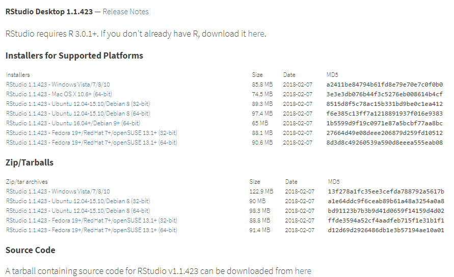
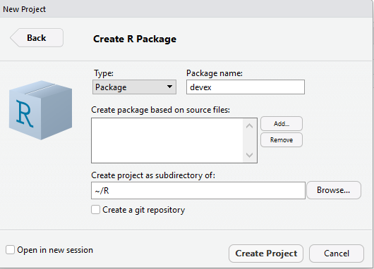

# A Note on IDEs

An IDE is simply a piece of software which aims to make it easier to write and work with packages (IDE stands for integrated development environment). If you're reading this guide, you'll probably spend  a decent amount of time writing packages, so we thought it'd be helpful to review a couple of different IDEs.

Broadly, there are two kinds of IDEs. 

1. Some IDEs are **language agnostic**, meaning that they support any programming language you care to program in. Language-agnostic IDEs are nice because (a) if you use one, you won't have to switch IDEs every time you use a different programming language, and (b) because you can write packages in multiple languages in them. 
2. On the other hand, some IDEs are **language specific** in that they are built for certain languages. Unsurprisingly, RStudio is a language-specifi IDE built for R. Language specific IDEs can be useful because they have a host of speciailized features for their specific language - as we'll see, RStudio makes it exceptionally easy to build and test R Packages. 

Let's run through a couple of examples.

## RStudio

RStudio is a language-specific IDE built for R, although it does support plenty of other languages. 

### Why use RStudio?

RStudio integrates documentation, makes graphics more accessible, and also combines beautifully with devtools to make it easy to write packages. We'll look at two concrete examples: initializing 
### Setting up RStudio

#### Setting up R

Presumably you've already been working with R, but you should make sure you have a recent enough version of R intalled. To do so, type "R.Version()" into the editor you've been working with previously. It should return an output titled "$version.string$", for example:
```{r}
R.Version()
```

If the number after the R version string is anything lower than 3.0.1, you'll have to install a new version of R in order to use R Studio. To do so, follow the steps below:

1. Go to https://cran.rstudio.com/ and select "Download R for [Your Operating System]." 

2. Click "base" and click "Download R [latest version] for [Your Operating System]" at the top of the page.

3. You can then let the installer run itself - the default settings should be fine for our purposes. 

Lastly, updating R on Windows can be a bit tricky. If you use Windows, you can also use the installr package to quickly update R, as documented [here](https://www.r-statistics.com/2015/06/a-step-by-step-screenshots-tutorial-for-upgrading-r-on-windows/). However, if you are having trouble installing the installr package, you can always just follow the instructions above. 


#### Setting up RStudio

To download and set up RStudio, follow the instructions below:

1. Head to https://www.rstudio.com/products/rstudio/download/ and click "download" for the free RStudio Desktop version

2. Download the *installer* for your operating system, not the *zip/tarball.* The picture below illustrates what the webpage should look like. 



3. Let the installer run - it's fine again to just use the default options. 

and now you're ready!

### Getting Started

#### Screen Breakdown

RStudio will split your screen into four parts, as shown below. We'll refer to them as the *script*, the *environment*, the *shell* or *console*, and the *Viewer.*


The *script* is in the upper left hand corner of the screen, and it's where you will do the bulk of your programming. To write an R script, click File>New File>R Script in the top left hand corner. You can execute multiple lines of a script (or the entire thing) at a time by selecting the lines you want to run and clicking the green "Run" button on the right hand side of the script box. 

The *console* or *shell* is in the lower left hand corner of the screen. Unlike scripts, which presumably you've worked with before, shells only run one line of code at a time. However, shells also remember what you did before. For example, if you define download some data into the shell, you can manipulate it repeatedly without having to download it again before each manipulation - it will stay in the shell's memory until you manually remove it.

All scripts that you run will be run through the shell. This means that you can run a script and manipulate the results directly from the bottom of the shell, without having to rerun the script each time you want to manipulate the results. You can also directly access the command prompt for your computer through the shell by clicking the "terminal" option.

Note that any errors thrown by your code will show up in the shell. To clear the console, hit Ctrl+L. 

On the upper right hand corner of the screen, you can see the *environment* you're working in, which lists all the objects in the shell's "memory" or *namespace.* For example, if you download some data in a script and then run the script, the data will show up in the right hand corner of the screen.

On the bottom right hand side is the *Viewer.* Any plots you generate in R will automatically show up there. Additionally, as we'll discuss later, documentation of functions and packages will appear in the right hand corner. You can also use it to see the file structure of your working directory and the packages you're using by clicking "files" or "packages.""

### Ex: Initializing Packages

RStudio makes it easy to create packages. To start, click File>New Project. Then, click "New Directory" when you see the screen below:


Then click "R Package" when you see the screen below:


Lastly, name your package. Your name should be something short and descriptive. Since we'll be walking through a development example, we'll title our new package "devex."



Once you've created your package, your RStudio should look something like this. It should come preloaded with a "Hello World" script which includes a handy function that prints "Hello world."


Everything should look mostly the same as normal except for the "Files" tab on the bottom right, which should include an ".Rproj" file, a "DESCRIPTION" file, a "NAMESPACE" file, and a folder titled "R." You should start by checking the little boxes next to the "NAMESPACE" file and the "Hello.R" R script inside the R file and clicking "delete" above them, just because we will have Roxygen2 automatically generate the namespace, and because presumably your package doesn't need a "Hello World" function. 

You should also go to "Tools > Project Options" and select the following options, which will help you generate documentation using roxygen2: 


### Ex: Building Packages

RStudio will build your package a little bit more conveniently than the devtools::build() function will. Whereas the devtools::build() function, without extra arguments, will simply bundle your package into one file, building your package from RStudio will actually install it into your R library, allowing you to easily use the finished version.

The way to do this is to go to Build > Install and Restart, and then RStudio will build your package, restart, and load your package into R (using the library command). Then, you can use and/or play with your package! 


<!-- 
Specifically, you should go to Build > Check Package.

Upon checking the package, RStudio will tell you if there are any warnings or errors raised by its automatic checking process. For example, it might tell you that a piece of documentation mismatches its complimentary function, or that the package needs an extra dependence. It's best to fix all of the problems RStudio points out, whether they are warnings or errors. 
--> 

(If you don't see any options under Build, you probably need to open your .Rproj file in the "file" section of RStudio. Upon doing this, RStudio should restart briefly and then you will see more Build options).
