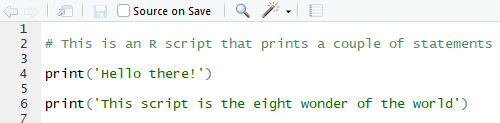
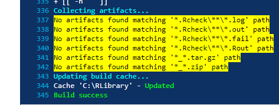

# Version Control

**Version Control** is the process of organizing and sharing different versions of your code, and it's surprisingly important. This chapter is a beginner-friendly introduction to Version Control with Git and GitHub. In it, we'll motivate Git/GitHub, and then discuss what precisely Git/GitHub do and how to use them.

There are other tools for Version Control out there, but Git/GitHub are by far the most common, so we've chosen to focus on them. As you might expect, much (but not all) of the logic behind GitHub applies to other version control systems too.

## Why use Git/GitHub?

Git and GitHub are actually two different things, and deserve their own sections. Before diving into specifics, however, we should talk about why Git/GitHub exist in the first place. Broadly, Git and GitHub are just tools that developers use to organize their code, which specifically solve three main organizational problems.

First, imagine that two imaginary programmers named Carlos and Grace are working together to build a website that automatically displays polling results from US elections, and suppose Grace modifies a script to change the method for aggregating polling data. It would be tedious for Carlos and Grace to email the script back and forth each time they updated it. Instead, they need a *repository* where they can update and sync their code to make sure they're on the same page. GitHub allows programmers to create such repositories. 

Second, imagine that farther along in the project, Grace decides that she needs to totally rewrite the code which stores and organizes polling data. Unfortunately, while Grace modifies the system which stores the data, it will be offline, which is unfortunate because Carlos needs to use the data for his work on the project. To avoid this dilemma, Git and GitHub allow programmers to create different versions, called *branches*, of their code. By branching, Grace can modify the storage system, and in the meantime, Carlos can continue to use the old storage system for his work. 

Third, suppose that once Grace and Carlos have finished their website, they want to publish all the statistical functions and tools they built so that other researchers can use those tools to reproduce Grace and Carlos's research. Putting all of their work on GitHub is probably the quickest and easiest way to make it accessible to other researchers.

### What is Git?


Git is a local version control system. In other words, Git automatically organizes and saves versions of code on your computer, but does not connect to the internet: it's purely accessible through the command prompt on a computer (there are also other ways to use Git, but it's generally best to use the command prompt). Git organizes code in two ways.

First, Git sends discrete versions of code to a local database or repository on the computer on which it is installed. To understand this, imagine that Carlos is writing an R script which determines the proper weights for aggregating polling data, and at some point he finishes the first version of the script. At this point, Carlos can send his code to the local repository, in an action called *commiting* his script. We'll discuss how to do this later, but note that scripts are not automatically committed to the repository. If Carlos deleted all the code in the script and saved it, he could still access the script by going into the repository. Moreover, the repository also stores all of the previous versions of code, and can backtrack through the various commits, so if Carlos decides the version of the script he built last year worked better, he can use Git to access it. 

Second, Git can create branches, or separate versions of code, on the computer it's installed to. Remember how Grace wanted to revamp the storage system for polling data without preventing Carlos from accessing the old storage system? Using Git, Grace should create a new *branch* in the repository. For most practical purposes, each branch exists as a separate version of the entire polling project in the Git repository, allowing Grace to modify and experiment without compromising the functionality of the *master* or original branch. 

While she's working, Grace can use Git to move back and forth between the branches. Then, when she finishes designing and testing the new storage system, she can *merge* the two branches together, and Carlos's scripts will automatically start using the new storage system. 


### What is GitHub?

Where Git creates *local* repositories on an individual computer, GitHub allows programmers to create *remote* repositories, stored online, for their code. This is a pretty simple concept, but it's extroardinarily useful. It means that when Grace finishes updating a series of scripts, she can simply *push* (push means send) them to GitHub, and then Carlos can in one command *pull* (download) the modified versions onto his computer to work with them. GitHub provides other important tools, but we will not discuss those until later. 

## Setting up Git/GitHub

### Making a GitHub account

Signing up for a GitHub is fairly simple - just go to GitHub.com, click "sign up" in the upper right hand corner, and follow the instructions. We recommend, at least to begin with, getting a free version of GitHub.

### How to Install and Set Up Git

Because Git is a form of *local* source control, it does require installation. To install Git onto your computer, go to one of the following sites:

  * For Linux: Head to https://git-scm.com/download/linux and follow the instructions.
  
  * For Windows: Go to https://git-scm.com/download/win and the download should automatically start.
  
  * For Mac: Click on https://git-scm.com/download/mac and the download should automatically start. 

If you are running Windows/Mac and the websites above download an installer, simply follow the instructions from the installer - it's fine to just use default settings. 

Before you can start using Git, you do have to do a one time set up. Git is built to track and organize old versions of code, so it will need you to set your username and email before it will let you start modifying programs. To set your username and email after installing, open the command line on your computer and type the following commands into it:

```{R, eval=FALSE}
$ git config --global user.name "Your Name"
$ git config --global user.email "youremail@email.com"
```

You might not get explicit confirmation from the command line - for example, when I set the username/email, I see the image below - but don't worry, Git has still received the message.


Now you're ready to start using Git/GitHub!

## Using Git/GitHub

### Initializing Projects and Repositories

The first step to using git is creating a project, or repository (repo for short). There are generally two ways to create a repo in Git. 

The first way to start a repo is by creating it on GitHub. To do so, log into your GitHub account. Look near the top-right for your profile icon, click it, and click "Your Profile." Then you should see "Repositories" in the top tab, and click on "Repositories". Then click the green "New" button on the right. 


GitHub will prompt you to choose a repository name and description of the repo, which you should enter, and will also ask you whether you'd like to initialize the repository with a README. You should not add README and .gitignore files, although we'll discuss their functions and importance later. For now, just initialize the repo without the README file. 

Once you've created the repository on GitHub, the next step is to link it with a local Git repository. To do this, open the *command prompt* on your computer. You'll need to enter a couple of commands to get the repo set up on your computer. 

First, you'll need to set the *working directory* in the command prompt. The working directory is the location where Git and command prompt will execute all of your commands - ie. if you tell Git to create a new file, the new file will be located your working directory. Thus, before you download your repository, you'll want to navigate to the folder in which you want the repository to be located. For example, Carlos might want to put a repo in his "R" folder inside the "Documents" folder on his computer. To do this, he'd use the `cd` command, which stands for "change directory," and then copy and paste the path of the folder he'd like to place the repository in. An example is given below:

```{R, eval=FALSE}
$ cd ~/Documents/R
```

Next, you will need to tell git to download, or *clone*, the repo. You can do this using the `git clone` command, which allows you to download and sync a repository *for the first time.* This will download the repo, with all its contents, onto your computer and automatically set up a local version of the repo. See an example of the command below:

```{R, eval=FALSE}
$ git clone https://GitHub.com/Carlos_Account/repository_name/
```


### Modifying Projects

It's best practice to create new R code files in your local project repository. When you save your code files, initially git will not be aware of them - that is, they will not be *tracked*, but we can change this by *adding* them to the local repository using the command `git add`. Here, the period following `git add` tells git that we want to start tracking all the files in the directory.

```{r, eval=FALSE}
$ cd ~/Documents/R/repository_name
$ git add .
```

Once new files are being tracked, we can put them under version control by *commiting* them, using the command `git commit`. You can add a message to indicate the changes you've made by typing `commit -am` followed by your message in quotes.  

```{r, eval=FALSE}
$ cd ~/Documents/R/repository_name
$ git commit -am "Fixed small bug"
```

Lastly, you need to *push* the files, which means sending them to GitHub online. You can do this by writing `git push -u origin master`, which will send the file to the remote GitHub repo. 


```{R, eval=FALSE}
$ git push -u origin master
```

### Accessing older versions of code

You should never be scared of Git/GitHub, because they only add information - they almost never delete it. In practice, this means that if you commit horrible changes to your code, you can easily revert to a previous version. For example, let's say Grace wrote some new functions for a script, deleted them and committed the deletes later on, but now wants the functions back. She can easily access the older script using Git. First, she should use the `git log` command to see what commits have been made recently.

```{R, eval=FALSE}
$ git log
```

This command might give an output like this:

```{R, eval=FALSE}
commit 06c347sa (HEAD -> master, origin/master, origin/HEAD)
Author: Grace Smith <gracesmith@gmail.com>
Date:   Sun Feb 18 23:13:32 2018 -0500

    Remove storage functions

commit b69a14b
Author: Grace Smith <gracesmith@gmail.com>
Date:   Sat Feb 17 23:11:28 2018 -0500

    Add storage functions

commit 8a237d1
Author: Grace Smith <gracesmith@gmail.com>
Date:   Fri Feb 16 21:28:46 2018 -0500

    Initial commit

```

Clearly, Grace should restore the second commit listed, named 'b69a14b,' in order to access the functions she deleted. To do so, Grace can use the `git reset` command.

```{r, eval=FALSE}
$ git reset --soft b69a14b
```

This will update the current version of the script to the b69a14b version, which Grace can then inspect and test until she's ready to commit it to Git/GitHub. Note that there is also a `git reset --hard` option, which works the same way, but is a pretty serious action to take because it will effectively delete all the commits prior to the version being restored. The soft option is almost always a better choice. 

### The .gitignore file

There's one more thing you should know about adding/modifying files that will make your life a lot easier. Sometimes, when modifying and commiting projects, you won't want to type out every individual file you've modified: you'll instead want to use the `git add .` command which will simply queue every modified file to be committed.

```{r, eval=FALSE}
$ git add .
$ git commit -m 'Message here'
$ git push
```

However, often, you'll have files in your directory which you do not want to commit or push to GitHub because they'll clutter up the directory. For example, R directories create ".RHistory" and ".RData" files which will save your history and working environment. These are useful perhaps when writing code, but you don't want them taking up space in your final packaged product. 

To solve this problem, you can use a *.gitignore file.* A .gitignore file tells Git to ignore certain kinds of files when you write `git add .`. For example, gitignore files are frequently configured to tell git to ignore csv files, .RData files, installer logs, and more. 

Let's discuss how *.gitignore* files actually work. A .gitignore file is really just a glorified text file. However, its filename should be just '.gitignore', because that's how Git recognizes it - then, if you put a file titled '.gitignore' in a directory you're working on, Git will use the .gitignore file to decide what to ignore in that specific directory. For example, if Grace is working on a project in '~/Documents/R/repo_name', she should create a '.gitignore' file inside that folder. 

This still leaves an important question - how does Git use the .gitignore file to determine which files to ignore? Essentially, .gitignore files are just a bunch of independent lines of text, and each line tells git another specific pattern of filepath to ignore. For example, consider the following example of a .gitignore file:


Each line beginning with a '#' is just a comment explaining the function of that part of the .gitignore file. However, there are a couple basic syntactical rules you need to understand.

1. If you write '.filetype', then all files which end with '.filetype' will be ignored by git. For example, the third line in the above example reads .RHistory," so all files with a '.RHistory' in the file name (even if the files are in subdirectories) will be ignored. 

2. If you write 'string,' then everything in the directory which contains that 'string' in it will be ignored. For example, if Grace wrote 'dog' in her .gitignore, then git would ignore both a file called 'dog.csv' and every file in a subdirectory called "dog".

3. If you prepend a pattern with an asterisk \*, then the asterisk \* serves as a wildcard which can match 0 or more characters. For example, if I write "*car", then git will ignore the file "mycar.R". 

4. If you prepend a pattern with a forward slash '/', then git will only ignore files which match that pattern in the parent (root) directory. For example, I might write '/.csv' in my gitignore file. This would cause git to ignore a file with the path "dog.csv", but it would not ignore a file called "data/dog.csv." 

5. If you prepend a pattern with an exclamation mark, git will *not* ignore that pattern. For example, if Grace really wanted to make sure her pictures of her dog were pushed to Git, she might write '!dog.PNG' to ensure git did not ignore that picture. 

The rules can seem confusing at times, but it's hard to go wrong - usually, there are at least 10 ways to ignore any given file you want to ignore. Moreover, if you're still confused, you might visit Atlassian, which has a wonderful table of all of the various syntactical tricks you can use in your own gitignores, linked [here](https://www.atlassian.com/git/tutorials/gitignore). 

Lastly (and most importantly), to save you time, the wonderful [NaLette Brodnax](https://www.iq.harvard.edu/people/nalette-brodnax) has created a template .gitignore file which you can use to declutter your GitHub repos. Using it requires three steps:

Step 1: Download the file "template.gitignore" from [here](.\template.gitignore). It should look something like this when you open it:


Step 2: Manually move the template file from your downloads folder to the directory of interest. For example, if Grace is working on a project in 'C:/Users/gracesmith/Documents/R/repo_name', she should copy the template into that folder. 

Step 3: Open the 'template.gitignore' file in the folder and save it just as '.gitignore'. This will help git recognize that your .gitignore file is in fact a .gitignore file. Your operating system might protest at this - Windows in particular freaks out at '.gitignore' files, which is why we initially named the template 'templates.gitignore' instead of just '.gitignore'. However, once the .gitignore file is in the correct directory, it's safe to change the path. Your end result should look something like this:


It has no name, but it will serve its intended purpose.

If you decide to create your own .gitignore file, you can follow very similar steps. 

1. Go into the directory you want and create a blank text file called 'template.gitignore'. It's necessary at first to keep the 'template' part because otherwise some operating systems will not let you create the file.

2. Start writing your gitignore file.

3. Save the file as '.gitignore.'

.gitignore files aren't glamorous, but they really are important - nobody wants to work with cluttered repositories.

### Branching


As we discussed earlier, branches allow you to modify scripts while simultaneous keeping the old versions easily accessible. In practice, the way this works is that the branch you select in git changes the way that scripts you open using explorer/finder appear. For example, if Carlos has the following script as the master (default) branch in Git, the script might look something like this when he opens it on his computer: 


However, if he uses Git to switch to a test branch, he might open the exact same file using his file explorer and see the following:



Let's discuss how to actually use git to branch.

##### Creating and Switching Branches

To create a branch, use the `git checkout` command followed with a "-b" and the name of the branch:

```{r, eval=FALSE}
$ git checkout -b branch_name
```

This will create a new branch which is identical to the initial (master) branch. You can modify it as you like, and you will still be able to easily access the initial (master) branch. To do this, simply use the `git checkout` command without the "-b" and type the name of the branch you want to switch to:
```{r, eval=FALSE}
$ git checkout switch_to_this_branch
```

Remember, switching to a branch will change the way the file shows up once you open it from your computer.

##### Merging Branches

Suppose you have created a test branch, tested it to make sure it works, and now want to combine it with the original master branch. To do this, use the `git checkout` command in combination with the `git merge` command as follows:
```{r, eval=FALSE}
$ git checkout master
$ git merge test_branch_name
```

These two commands will merge the test branch into the master branch, meaning that the master branch at the end of the merging will look like the test branch. 

### Conflicts

Sometimes, however, Git will be unable to push or pull branches because it is getting conflicting information from two users. For example, suppose Grace has written the following function, which calculates the squared error between two values:


This function clearly has a bug in it, because it claims to return the squared error, but instead, it returns the absolute value of the error. Carlos notices this, and modifies the function so that it accurately reports that it calculates the absolute value, and pushes his modified version to GitHub:


But before Grace realizes Carlos has modified the script, she also fixes the bug, but instead by changing the absolute value to a squaring function:


Git is smart, so when Grace tries to push her version to GitHub, Git will recognize that the two versions of the script conflict. As a result, it will throw the following error:

```{r, eval=FALSE}
C:\Users\gracesmith\Documents\R\repo_name>git push
To https://GitHub.com/gracesmith/repo_name
 ! [rejected]        master -> master (fetch first)
error: failed to push some refs to 'https://GitHub.com/gracesmith/repo_name'
hint: Updates were rejected because the remote contains work that you do
hint: not have locally. This is usually caused by another repository pushing
hint: to the same ref. You may want to first integrate the remote changes
hint: (e.g., 'git pull ...') before pushing again.
hint: See the 'Note about fast-forwards' in 'git push --help' for details.
```

Effectively, Git recognizes that Carlos has made modifications to the script which were pushed to GitHub that Grace doesn't have. This usually happens *when two programmers modify exactly the same line in a single script*, such as line 6 in the above examples. To solve this problem, Grace should follow Git's advice, and try the `git pull` command. This will lead to the following message from git:

```{r, eval=FALSE}
C:\Users\gracesmith\Documents\R\repo_name>git pull
remote: Counting objects: 3, done.
remote: Compressing objects: 100% (3/3), done.
remote: Total 3 (delta 1), reused 0 (delta 0), pack-reused 0
Unpacking objects: 100% (3/3), done.
From https://GitHub.com/gracesmith/repo_name
   e719863..59fc0ba  master     -> origin/master
Auto-merging scriptname.R
CONFLICT (content): Merge conflict in scriptname.R
Automatic merge failed; fix conflicts and then commit the result.
```

Again, Git is letting Grace know that it sees there's a conflict and that Git needs human help to fix it. Once Grace has pulled Carlos's changes, she can go open the script in her computer and should see something like the following:


The "<<<<" and ">>>>" lines are in the script to signal the beginning and end of a merge conflict, whereas the "===" line separates the two different versions. On the top is Grace's version and on the bottom is Carlos's. To resolve the merge conflict, Grace should manually select the two lines she prefers and then delete all of the "<, =, >" symbols to let Git know that the conflict has been resolved. Then, she can commit and push the file to Git, and she'll be good to go!

Overall: merge conflicts are rather annoying and can be confusing, so the best way to avoid them is to clearly delineate which programmers will be working on which sections of which scripts. This will prevent Git (and you) from getting confused.  

##### Suggested Workflow

There are many ways to use Git, but [this article by Vincent Driessen](https://nvie.com/posts/a-successful-git-branching-model/) describes a pretty intuitive and productive model for Git branching. It's worth reading or skimming the article (it includes some great graphics), but it basically involves a couple of core kinds of branches:

- The **master** branch is only used for new releases of a package/software.
- There are **hotfixes** branches which are used to fix relatively important bugs on releases.
- The **development** branch is the central branch on which most of the development happens; i.e. fixing minor bugs and adding new features between releases. 
- There are **feature branches** which are used to develop new features between releases, which are periodically updated with the development branch.
- Finally, there are **release branches** which are used exclusively to fix bugs pre-release.  

Here's an illustration of the core model which Driessen made: 


### Tips and Tricks

Git can be confusing, but there are three general rules of thumb you can follow to figure out any bugs that come up.

1. Git is super smart. If there's a bug and Git is recommending a particular way of fixing it, there's a very high chance that Git is right. 

2. Use the git status command. After entering git status, Git will give you a rundown of the status of the entire repository.  

3. If that doesn't work (or you don't understand what is going on), you can always copy and paste the error from the command line into Google and reference stackexchange. There is a wealth of online help!

Remember that Git almost exclusively *adds information*, meaning that you can always just go back and restore a previous version - you'll never lose your work.

Lastly, there are a couple of cheat sheets that you can use to make your life easier. 

* [Stackoverflow](https://stackoverflow.com/questions/tagged/r) provides online help for programming in R

* [Karl Broman's tutorial](http://kbroman.org/github_tutorial/pages/init.html) runs you through initializing a repository 

* [This official GitHub cheat sheet](https://github.github.com/training-kit/downloads/github-git-cheat-sheet.pdf) lists all of the general commands you'll need

## Optional: Integrated Testing

### Why use Integrated Tests?

When working on packages alone, you may not push to GitHub too often. However, in large projects/packages where many programmers are working on the same package at once, it's important to ensure each programmer continuously commits changes to GitHub to make sure all the changes are compatible with each other. This process of rapid updating of packages is referred to as *continuous integration*, and it can be very difficult to manage properly (it is sometimes referred to as *integration hell*, specifically because developers often waste lots of hours trying to make code integrate properly). When you commit changes continuously, it does not guarantee that all the changes will be compatible. However, if there are compatibility problems in updates, it does ensure that you'll be able to find those problems more easily, because each individual change/commit is smaller. 
For reasons we'll discuss in a second, continuous integration is a bit easier said than done. Thankfully, there are two wonderful free continuous integration services that will make your life a lot easier. If you're using windows, you'll want to use the service called *Appveyor* - if you're using Mac or Linux, you'll want to use the service called *Travis CI*. These services will make continuous integration easy, specifically because both Appveyor and Travis CI link to GitHub and will run your build and tests for you on what are called virtual machines in the cloud. 

Maybe the principle of continuous integration makes sense, but why are continuous integration services useful? Why can't each developer build packages,  run the tests locally, and then only push changes to GitHub if the tests are successful?  There are three answers to this question. 

1. For large projects, it often takes a long time to build them. Being able to build them on the cloud (using Appveyor/Travis) saves an enormous amount of time. (This is especially true for programming languages besides R, but it's true for R too!)
2. Sometimes there may be global environmental settings on your particular computer which change the way the package works and the way tests run. Building and testing the package in a "clean" environment online makes the testing more robust. 
3. Lastly, CI services offer settings to automatically 'deploy' or publish successful builds, for example by publishing code for a website. These are a bit beyond the scope of this guide, but they are documented [here (Appveyor)](https://www.appveyor.com/docs/deployment/) and [here (Travis)](https://docs.travis-ci.com/user/deployment/). 

### The integrated testing workflow

It's important to note that Travis/Appveyor do not prevent you from pushing bad code to a repo - if you break your package and all your tests fail on Travis/Appveyor, you can still push the broken version to the master branch on GitHub. As a result, most developer teams use the following workflow to keep the master branch working at all times.

1. Someone sets up a "master repo" with a master branch on GitHub. 
2. Each developer on the team creates a copy (also called a *fork*) of the master repo. Thus, each developer has their own repository.
3. Each developer makes changes to the project and then pushes those changes to their personal fork. After each push, Appveyor or Travis builds the package and test it. 
4. If the Appveyor/Travis builds are successful, the developer will likely send a pull request to the master branch of the master repo, which will probably be accepted. 

This workflow allows each developer to make changes in their own repo and continuously build them using Travis/Appveyor without potentially breaking the master repo's copy. 

### Setting up Integrated Tests

**Step 1**: To get started using continuous integration services, head to the Travis CI (Linux/Mac OS) or AppVeyor (Windows) website and "sign up"" by signing into GitHub. At some point, Travis/AppVeyor will ask you to authorize its connection to GitHub, which you should authorize.

**Step 2**: Once you authorize the connection, you need to specifically select which repos you'd like to use Travis/AppVeyor with. For example (in AppVeyor), upon signing up, you'll see something like this screen:


You should click "new project" and then select the specific repo you'd like to use in combination with Travis/Appveyor. This means that you should at least initialize your project and push it to GitHub before you start using Travis/Appveyor. 

**Step 3**: Depending on whether you're using Appveyor or Travis, you should run `devtools::use_appveyor()` or `devtools::use_travis()` in the console with your package open. This will create a file named 'appveyor.yml' or 'travis.yml' in the root directory of your package. These '.yml' files will tell AppVeyor/Travis what to do. It's actually not too important to understand everything they do, just because the devtools template generally works pretty well. However, you occasionally will have to modify it to suit specific needs. AppVeyor and Travis CI both have great documentation, linked [here for Appveyor](https://www.appveyor.com/docs/build-configuration/) and [here for Travis](https://docs.travis-ci.com/user/languages/r/).

(Note - devtools also adds 'appveyor.yml' and 'travis.yml' to the .Rbuildignore to reduce clutter in your package.)

**Step 3.5: Dependency Issues**: If you're using Travis, it's important to talk quickly about dependencies in packages. Travis was not originally designed for R projects, so occasionally it's a bit shaky, specifically with regard to dependencies in packages (i.e. Travis will build your package online, but if your package depends on ggplot2, then Travis will have to install ggplot2 before building your package). By default, Travis/Appveyor automatically install anything listed in the dependencies listed in the DESCRIPTION file for your project. However, occasionally something goes wrong. If you get error messages that look like Travis did not install all of the dependencies, it's worth specifying them in the .yml file. You can by adding a line like the following:

```{r, eval = FALSE}

r_packages: package_name

```
 in the .yml file (this will install the package the same way that R installs it when you run `install.packages`). If you'd like to install a package using a different method (i.e. from a GitHub version of the package), there are lots of options listed in the [R-specific Travis documentation](https://docs.travis-ci.com/user/languages/r/). However, it's important to remember that this is generally NOT necessary - Travis/Appveyor do a pretty good job of automatically detecting/installing dependencies as long as your DESCRIPTION file specifies them.

**Step 4**: If you are working with many other developers on a single package, you should also add a '.gitattributes' file into the root of your directory. This is because different operating systems handle different characters, for example line terminators, slightly differently. Modern Mac and Unix/Linux systems use '$\n$' to terminate the end of each line, in what is called the "line feed" or "LF" system, whereas Windows uses '$\r\n$' in the 'Carriage Return Line Feed' or CRLF system. The point is that the '.gitattributes' file will ensure that each developer uses exactly the same line endings, because you can set the 'text' setting which controls the method of writing lineterminators.

The way it works is that the '.gitattribute' file should be a line of path-patterns followed by specific attributes. These path-patterns (for a refresher, see the Atlanian guide [here](https://www.atlassian.com/git/tutorials/saving-changes/gitignore)) are exactly the same path-patterns used in the .gitignore file, just for a different purpose. For example, one line might be
```{r, eval=FALSE}
* text=auto
```
where the "*" refers to all files in the root directory, and the 'text=auto' sets the 'text' attribute to auto. Alternatively, you could write
```{r, eval=FALSE}
R/* text=lf
```
which forces all the scripts directly in the R subdirectory to use the 'lf' line terminator. You can personalize the gitattributes file if you like, but you can also just use the sample .gitattributes linked [here](https://GitHub.com/krlmlr/r-appveyor/blob/master/.gitattributes). You can download this file and move it to the root directory of your package (it must be in the root directory). 

The git attributes file actually is useful for setting a variety of other attributes besides line endings, although some of them are a bit technical. If you're curious to find out more about what the .gitattributes file can do, the full documentation is linked [here](https://git-scm.com/docs/gitattributes). 

Once you do all of this, you're set to go! When you push changes to GitHub, all the new files (.yml, .gitignore, .gitattributes) you created will be pushed to the remote. Travis/AppVeyor will automatically build and test the package for you. For example on Appveyor, if you sign in, you should see something like this:


and if your build succeeded, you'll see a green line at the bottom like this:



otherwise you'll see an error. If your build takes a while, that's okay - you don't need to wait for it to build, because Travis/Appveyor will email you automatically if the test fails. And that's all there is to it! 


## Further reading

If you're interested in learning more about Git and GitHub, you might want to take a look at the following resources:

* The Software Carpentry Foundation has a great mid level Git tutorial [here](https://swcarpentry.GitHub.io/git-novice/)

* Atlassian has some wonderful advanced Git tutorials [here](https://www.atlassian.com/git/tutorials/advanced-overview)