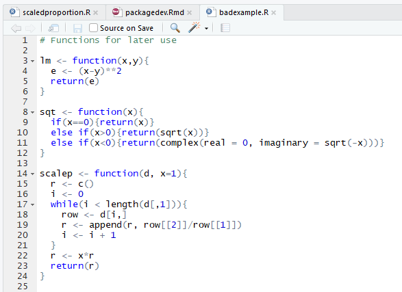

### -1. Overall to-do

2. Run through for consistency, figure out how to publish best
3. Is there an rtools problem?

### 0. To-do for intro

1. Finish acknowledgements
2. Maybe revamp?

### 1. What is a package?

Let's say you wrote a script like this in R and wanted to make it easy for others to use.

As you can probably tell, other users may not understand exactly what this script is supposed to do and how to use it. Even if they take the time to read through the source code and eventually figure it out, it might have been faster for them to just write the functions themselves. Packages solve this problem. Loosely speaking, *packages* are structured collections of code which aim to make your code easily sharable and reproducible. For example, any good package includes *documentation* which describes its functionality and use. Developing packages can be painstaking, but thankfully there are lots of tools today which make it extremely simple to create robust packages. This guide aims to run through how to use those tools and develop packages in R.

### 2. What's the structure of this guide?

This guide is organized into two big parts. 

1. In the first part of this guide, we'll run through how to use two pieces of software - [RStudio](./rstudioguide.Rmd) and [Github](./githubguide.Rmd) - which make developing packages a lot easier. 
2. In the second part of this guide, we'll run through [the proper way to structure packages](./packagedev.Rmd) and [the proper way to test them](./testingguide.Rmd) during development. 

Also, this guide is still under development, and we take feedback! If you find anything confusing or think the guide misses important contant, please email amspector100@gmail.com.

### 3. What do I need to know before reading this guide?

Almost nothing! You don't need to know anything about Github, Rstudio, or package structure. However, this guide does assume you know how to do some programming in R. For example, if you want to develop a package which downloads and analyzes the content of politicians' tweets, this guide will help you structure your code, but it won't teach you how to scrape Twitter. 

### 4. Major Acknowledgements

It's worth acknowledging a couple of people who helped make this guide possible.

1. A huge thanks to Simo Goshev at the IQSS, who helped design the structure of the guide and edited the content. 
2. This guide was written for a different audience, but a lot of its structure and content is based on Hadley Wickham's book [R Packages](http://r-pkgs.had.co.nz/). A huge thanks to him as well.

We'll also be citing specific sources on each page in the guide.

