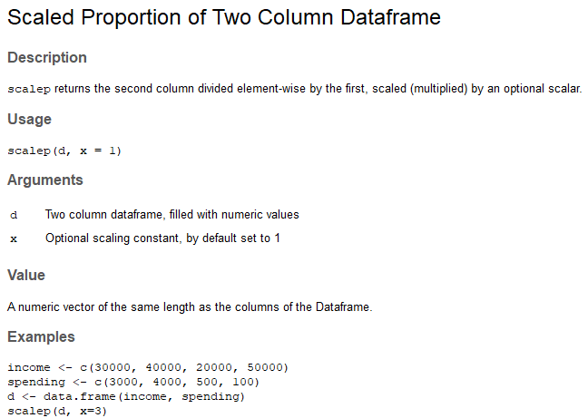
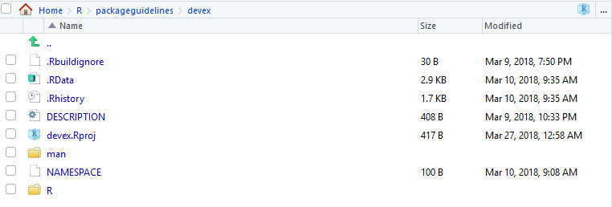

# Package Structure

The previous page in the guide discussed [GitHub](./githubguide.html). The next page in the guide will discuss [testing packages](./testingguide.html). This page will walk you through the structure, motivation, and process of building packages in R. We'd like to extend a huge thank you to Hadley Wickham's book [R packages](http://r-pkgs.had.co.nz/r.html#r); this part of the guide is basically a significantly condensed and simplified version of that book. A huge portion of the credit should go to him. 

A quick reminder for readers who do not want to use RStudio: this part of the guide relies on the devtools package, so if you can't use RStudio, it's worth following along by looking at the [source code](https://www.rdocumentation.org/packages/devtools/versions/1.13.3/source) and [documentation](https://www.rdocumentation.org/packages/devtools/versions/1.13.3) for devtools.

Lastly, you can find the 'devex' example package linked [here, on GitHub](https://github.com/amspector100/packageguidelines/tree/master/devex), if you'd like to look through it while reading the guide. 

## Motivation

Imagine Grace has built an architecture for aggregating polling data, and you would like to use it in your own research project. So you go to GitHub and you download Grace's repository, hoping to build on her research. One of the scripts you download looks like this. 


When you read this script, you should notice at least a couple of problems.

First, upon reading this code, most programmers would have absolutely no idea what it's supposed to do. Because this is a simple example, you might be able to guess that the lm function returns the squared difference of its inputs, and the sqt function takes the square root of negative numbers. But the "scalep" function is almost totally incomprehensible - what's it supposed to do? 

Second, even if you could tell what the "scalep" function does, you'd have no idea how to use it, because you don't know how the "d" input should be structured. 

Third, it's very difficult to use this script in combination with other packages. The "lm" function has the same name as the "lm" function from the R Stats package, which is incredibly useful, and very commonly used. Giving a new function the same name as a base or commonly used function will create extremely weird bugs or just cause a fatal error and end your entire session. 

Lastly, and less obviously, you don't know what *version* of Grace's package this script is. Grace will probably update and modify her scripts over time, and unless you are aware of the contents of those changes, the script may behave differently than you expect.

Yet never fear - packages don't need to be this way! Most packages are extremely well-built and easy to use. In this section, we'll demonstrate how to make sure your packages are like those packages. 

## Solutions

In this section, we'll discuss the solutions to the problems outlined above. For each problem, we'll discuss the conceptual solution, and then we'll describe how the structure of R Packages allows users to integrate those solutions. Note that this section mostly just outlines package structure - we won't talk about actually creating things like documentation until the next couple sections. 

### Code Style

The first solution is to write code differently. The script above has a couple problems with style. Specifically, note the difference between the following two code samples:

```{r}
sqt <- function(x){
  if(x==0){return(x)}
  else if(x>0){return(sqrt(x))}
  else if(x<0){return(complex(real = 0, imaginary = sqrt(-x)))}
}
```


```{r, eval=FALSE}

# This function takes the complex square root of real numbers

general_sqrt <- function (x) {
  
  # Return the normal square root if x > 0
  if (x > 0 || x == 0) {
    return(sqrt(x))
  } 
  
  # Else return the complex square root

  else {
    return(complex(real = 0, imaginary = sqrt(-x)))
  } 
  
}

```

Clearly, the second example is a lot more readable and a lot easier to understand. Later, we'll talk about specific coding guidelines, but for now, just remember that the goal of programming style guides is to make your code *readable* and therefore *useable*. This will also make it a lot easier for others to fix and find bugs in your packaged code. 

### Documentation

Of course, nobody wants to read through packaged code in order to guess what a function does. Instead, packages also include documentation to tell users how to use different functions and objects developed in the package. For exampe, imagine you typed '?scalep' into the Console and got the following result:



This documentation tells you what the scalep function does, what kinds of inputs it needs, what kind of output it returns, and gives you examples of how to use it. Documentation makes packages usable, and is suprisingly easy to write using devtools and roxygen2, so it's a critical part of any package. 

### Description

The DESCRIPTION file of an R Package helps solve each one of the first three problems. It briefly outlines the purpose of the package, as well as the version of the pacakge and who maintains it. Perhaps most importantly for newer users, it also documents the dependencies of your package. For example, if you wrote a package which relies heavily on the boot package version 1.3-20, your description will document that, so your users don't have to spend hours searching for the exact package necessary to make your package work. 

### Namespace 

The namespace is a bit more complicated than the other parts of the package structure. The purpose of the namespace is make sure your package works in combination with other packages. For example, if your package includes some data labelled 'lm', a good namespace will ensure that using that data in conjunction with the R stats package (which has a function called 'lm') will *not* throw an error. How exactly the namespace does this is a bit complicated and beyond the scope of this guide, so if you're dying for more specifics, you should [read through this wonderful page](http://r-pkgs.had.co.nz/namespace.html). Thankfully, Roxygen2 will automatically generate a namespace for you - we'll discuss how to do this a little later. 

Remember: the namespace will help your package play nice with others in the event of name conflicts, but it's still better to name your functions so that the they don't overlap with names of other commonly used functions if possible. 

Now that we've gone through the overall structure of packages, we'll walk you through what Grace *should* have done - the process of building an R package from start to finish. 

### The README

The README file is a bit different than the others, because your package will actually work fine even if you don't have one. However, if you want other people to ever use your package, it's best to have a README. The purpose of a README is basically to bridge the gap between the DESCRIPTION and the actual documentation in your package. In other words, someone using your package might know what it does in a general sense from your DESCRIPTION, but they won't necessarily know exactly how to set up the package or how to use specific functions. The README takes care of that. In general, READMEs should do at least two things, with a couple of optional ones:

(Important):

1. Offer a longer (one to three paragraph) description of the package
2. Help users install and set up the package

(Optional from here on):

3. Tell developers what to do if they want to contribute to your package
4. Help contributers figure out how to run the packages' unit tests (we'll talk more about unit tests in the next section)
5. Offer some acknowledgements

This template linked [here](https://gist.github.com/PurpleBooth/109311bb0361f32d87a2) is pretty good. Again, because your package will technicaly function without your README, the actual structure and content of a README can be flexible. However, just remember that if you don't have a README which outlines why and how to use your package, other developers are unlikely to want to use it.

## The Walkthrough

### Initializing the Package

RStudio makes it easy to create packages. To start, click File>New Project. Then, click "New Directory" when you see the screen below:


Then click "R Package" when you see the screen below:


Lastly, name your package. Your name should be something short and descriptive. Since we'll be walking through a development example, we'll title our new package "devex."


Once you've created your package, your RStudio should look something like this. It should come preloaded with a "Hello World" script which includes a handy function that prints "Hello world."


Everything should look mostly the same as normal except for the "Files" tab on the bottom right, which should include an ".Rproj" file, a "DESCRIPTION" file, a "NAMESPACE" file, and a folder titled "R." You should start by checking the little boxes next to the "NAMESPACE" file and the "Hello.R" R script inside the R file and clicking "delete" above them, just because we will have Roxygen2 automatically generate the namespace, and because presumably your package doesn't need a "Hello World" function. 

You should also go to "Tools > Project Options" and select the following options, which will help you generate documentation using roxygen2: 


### Modifying the DESCRIPTION File

The DESCRIPTION file gives an extremely brief overview to the package. It includes critical information such as the author of the package, the title, a very short summary of its purpose, and the liscensing information. Double click on the "DESCRIPTION" file on in the files section to open and edit the DESCRIPTION tab. 

DESCRIPTION is a DCF file. This file format may be unfamiliar to you, but it's quite simple. Each line contains a a fieldname and value, separated by a colon. Sometimes, values are long enough to require multiple lines, in which case they are indented by four spaces. For example, the DESCRIPTION file for the devex package might look something like this:


Let's go through the fields and discuss what they mean. The first seven fields listed are mandatory, meaning that if you do not include them, the development environment will throw an error later on when you're trying to build your package. 

1. **Package**: This is the name of the package. It should match the package name you chose earlier, and you should probably just leave this as is. 
2. **Title**: A short but more descriptive title of your package than its name.
3. **Version**: The version of your package. Since you're creating this package for the first time, presumably it's version 0.1.0.
4. **Author**: Here, you should add in your name. 
5. **Maintainer**: Here, you should add in your name as well as a valid email enclosed in <> brackets. Note that if you do not enter a valid email, the development environment may throw errors later. 
6. **Description**: This should be a one-paragraph *comprehensive* description of the package. It is necessarily a high level-description, but it should be a complete one. 
7. **License**: You should add in a License, which describes how others can legally use the package. Most of the time (especially in the US), you should write 'CC0' in the License field, which implies that the package is open for all use, and you have relinquished all your rights to it. For more information on various licensing options, click [this link](https://cran.r-project.org/doc/manuals/r-release/R-exts.html#The-DESCRIPTION-file).
  
(Note all of the fields from this point on are optional, but encouraged!)

8. **Type**: This describes what type of project you're creating - in this case, because you're creating a package, you should write "Package."
9. **Date**: The date, in YYYY-MM-DD fashion. 
10. **LazyData**: Write "true" after LazyData and the colon. Writing 'true' ensures that if you include any data with your package (which you frequently will), when another user loads your package, they won't automatically load up the data, but will only load it if it becomes necessary during their use. This option reduces the amount of RAM users have to expend when loading packages, especially if you are planning to include a lot of data with your package.
11. **Encoding**: Just leave this as "UTF-8"; discussing what encodings are isn't super important for this guide. If you're dying to learn about encodings, visit [this webpage](https://www.w3.org/International/questions/qa-what-is-encoding). 
12. **RoxygenNote**: Roxygen will automatically fill in the version of Roxygen2 used to build the package in this field. 

(These fields are exceptionally important if you are building a package using tools from other packages)

13. **Imports**: In this field, you should list the packages which your package needs to function. Each package should be indented by two spaces, separated by a comma, and given its own line. For example, a pacakge which requires ggplot2, nlme, and rpart might have an 'imports' field which looks like this:


14. **Suggests**: Sometimes, your package will not really *require* the use of other packages, but it might offer a couple of extra wrappers/functions with those other packages. When those extra functions aren't strictly necessary, it's a good idea to have your package *suggest* imports. For example, if Grace modified the scalep function to look like the following code, she might put ggplot2 in the 'suggests' part of the description. 

```{r, eval=FALSE}


scalep <- function(d, x=1){
  ...
  
  # If ggplot2 is available, use its qplot function - else, use the default hist function
  
  if (requireNamespace("ggplot2", quietly = TRUE)) {
    ggplot2::qplot(r, geom='histogram')
  } else { 
    hist(r)
  }
  
  ...
  
}
```

Here, the function 'requireNameSpace' checks if 'ggplot2' is available, and if not, the function uses the (slightly less pretty) default histogram function. 

Once you know which packages to list in the 'suggests' section, you can list them exactly the same way you'd list functions in the 'imports' section: each package is indented by two spaces, separated by a comma, and gets its own line. 

In general, it's best to suggest functions instead of requiring them if you barely use them in your package. This will give users a bit more flexibility, because it won't force them to download packages they will probably never use. 

### Starting to Program

#### General Coding Guidelines

All of your code should be in scripts in the 'R' file created in the RStudio package development environment, as shown below:


The coding you will do in package development is slightly different than the coding you'll normally do when writing R scripts. This is for a couple reasons:

1. When you write a script and load that script using source(script_name), the code in the script runs when you load it (specifically, when you run the 'source' command). On the other hand, the code in a package is run when the package is *built* on your computer. As a result, your code should mostly be focused on building functions, as opposed to a series of actions which the computer ought to take. 
2. Unlike your personal scripts, other people will be using your package, and if your package is good, they'll be using it in ways you didn't anticipate. This means you ought to really try to make sure your code is as general as possible and can support a variety of approaches and implementations. 
3. Also, because other people will be using your package, you should avoid modifying the global RStudio landscape with your package. This means avoiding using functions like require(), library(), or source(); instead, there are other alternatives which can accomplish the same goal without changing the global environment and potentially giving other users an unwanted surprise. For example, instead of using library() and require(), you should be listing your necessary imports in the DESCRIPTION file, as outlinted above. Consider the bad example listed at the beginning of this section, where you saw something that looked like this:

```{r, eval=FALSE}
# Functions for later use

require(ggplot2)

 ...

scalep <- function(d, x=1){
 ...
  qplot(r, geom='histogram')
 ...
}

```

This is a bad example, because it uses "require." Instead, you should be listing your packages' necessary dependencies in the DESCRIPTION file, and then RStudio will make sure anyone who loads your package also loads the other packages you used to write your package (also, when users install your package, RStudio will also make sure that the other packages necessary are installed for other users too). The one catch is that you'll now have to append 'packagename::' in front of the imported functions you want to use, otherwise RStudio won't recognize them. Thus, in the previous example, the code should look something like:

```{r, eval=FALSE}

 ...

scalep <- function(d, x=1){
 ...
  ggplot2::qplot(r, geom='histogram')
 ...
}

```

The last thing you should know is that if you want your package to plot things, you will have to surround the "plot" commands with a print statement, like this:

```{r, eval=FALSE}

 ...

scalep <- function(d, x=1){
 ...
  print(ggplot2::qplot(r, geom='histogram'))
 ...
}


```


You should also take care to organize your functions properly. It's probably a bad idea to stick them all into one script and title it "functions." Instead, you should organize functions by their purposes - for example, a variety of loss functions might go into a single script. Of course, some very complicated functions might deserve their own script. The file names of the script should be descriptive - for example, a script of loss functions might be named "loss_functions.R". 

#### Code Style

Now let's talk about specific elements of code style. These are shortened and adapted from [Hadley Wickham's book on R package development](http://r-pkgs.had.co.nz/r.html), which in turn were adapted from Google's R style guide. For more advice on everything from naming variables to curly bracket placement, head to that aforementioned link.

1. **Comments**: Comments are the best (and easiest) way to make your code readable. In general, you should err on the side of commenting too much rather than too little, and your comments should explain the *motivation* of your code as opposed to what your code actually does (although admittedly the line between those two things is a bit blurry). Moreover, you can use lines of '# ---------------------------' or '# ==================' to separate distinct sections of your code. Here's a good, if simple, example of commenting:

```{r}

# This function returns the squared difference element-wise between two vectors

loss <- function(x,y) {

  error <- (x-y)**2

  return(error)
}

#---------------------------------------------------------------------------

# Takes the square root of any real number, returning a complex number

general_sqrt <- function (x) {

  # Return the normal square root if x > 0
  if (x > 0 || x == 0) {
    return(complex(real=sqrt(x), imaginary=0))
  }

  # Else return the complex square root

  else {
    return(complex(real = 0, imaginary = sqrt(-x)))
  }

}
```

2. **Names**: Naming variables and functions is tricky - names should be descriptive but concise, and variable names should generally be nouns whereas function names tend to be verbs. Moreover, most R developers keep their function/variable names all lowercase and separate multiple words with underscores. There are no strict rules on this, but at the very least it's nice to be consistent with *some* rules because it makes your code more readable.

```{r, eval = FALSE}
# Bad example - function name
f <- function(x) {
  return(sqrt(x))
}

# Good example - function name
take_sqrt <- function(x){
  return(sqrt(x))
}

# Bad example - variable name
s <- read.table(path)

# Good example - variable name
car_data <- read.table(path)

```

3. **Spacing**: In general, you should use a lot of spaces, because they make your code a lot more readable! Specifically, you should always surround parenthesis with spaces; the exception is when you're making a function call. Note that this means you should surround the parenthesis themselves with spaces, but not the objects within the parenthesis, which should *not* be surrounded with spaces. You should also surround operators (like +, -, <-, =, /, **, others, etc) with spaces; see the examples below.

```{r, eval = FALSE}
# Bad examples of parenthesis spacing

if(a == 7)do(something) # Needs spaces before/after the parenthesis
if ( a == 7 ) # Shouldn't be spaces around 'a == 7'
function_call (parameter) # Shouldn't be a space between function_call and (parameter)

# Good example of parenthesis spacing

if (a == 7) do(something)
function_call(parameter)

# Bad example of operator spacing

a<-a+3 # Needs spaces 

# Good example of operator spacing

a <- a + 3


```

4. **Curly Braces**: You should start a new line after you write an opening curly brace, and ending curly braces should get their own lines, unless you have an else clause. 

```{r, eval = FALSE}
# Bad examples

if (condition) {
  do (x)} # Ending curly brace should get a new line

if (condition) { do(x) }

if (condition) {
  do(x)
}         # The else should be on this line
else {
do(y)   # This line should be indented with two spaces
}


# Good examples

if (condition) {
  do(x)
} else {
  do(y)
}

```

As always, you can break the rules if you have a good reason to. For example, the extra indentation in the following example helps maintain alignment and increases the readability of the code. 

```{r, eval = FALSE}
# Exception which proves the rule - the alignment improves readability
my_function = function(argument_1 = 'this string is extremely long',
                       argument_2 = 'this string is even longer somehow',
                       argument_3 = 'this string is also pretty long') {
  
}
```


Overall, different organizations and programmers have different styles and guidelines for specific coding style. Some programming guides might require you to avoid [camelCase](http://wiki.c2.com/?CamelCase); others might mandate its use. We've tried to document some pretty broadly accepted norms, but in general, you should remember:

1. Your goal should always be to make your code readable!
2. Whatever style guide you follow, follow it *consistently* to make your code readable
3. You should generally adapt to follow the conventions of the organization you're working under/for

### Warnings and Simplicity

Consider the case of the scalep function, which currently takes a 2-column dataframe as an input, divides the second column by the first, and returns/graphs some scaled proportion of the quotient vector. One version of this function, which follows almost all of the guidelines above, might look like this:

```{r, eval = FALSE}
scalep <- function(d, x=1){

  # Intialize resulting vector
  result <- c()

  # Iterate through and divide column 2 of d by column 1 of d
  i <- 0
  while(i < length(d[ ,1]) + 1){
    row <- d[i,]
    result <- append(result, row[[2]]/row[[1]])
    i <- i + 1
  }

  # Print the graph using either ggplot2 or the hist function
  if (requireNamespace("ggplot2", quietly = TRUE)) {
    print(ggplot2::qplot(result, geom='histogram'))
  } else {
    print(hist(result))
  }

  # Return the result, multiplying by the optional scalar
  result <- x*result
  return(result)
}
```

However, this function still has a couple of problems. It's not super easy to use because (a) it's understandably hard for other programmers to remember which column is divided by which and (b) there's a simpler way to accomplish the code above which will make it more readable. Specifically, it might be easier to just have arguments called 'factors' and 'divisors' and then divide them, like this

```{r, eval=FALSE}
scalep <- function(factors, divisors, constant = 1) {

  # Divide and multiply by optional scalar
  proportions <- constant*factors/divisors

  # Print the graph using either ggplot2 or the hist function
  if (requireNamespace("ggplot2", quietly = TRUE)) {
    print(ggplot2::qplot(proportions, geom='histogram'))
  } else {
    print(hist(proportions))
  }

  # Return the result
  return(proportions)
}

```

The new argument structure will make it a bit easier to use. Similarly, the new structure simplifies the code, making it a bit more readable. However, it does pose one problem: whereas the previous structure mandated that the two vectors be the same length (because they were part of a dataframe), in this function, the two vectors might not be the same length and the function would not always throw an error (specifically, if 'factors' has a length which is is an integer multiple of the length of 'divisors', R will not warn the user at all). This problem is a type of **silent error** (silent errors are bugs which do not issue warnings or errors). Silent errors are terrible because they make bug-hunting extremely difficult: in large repositories of code, it becomes nearly impossible to find which specific line is causing problems without some kind of warning. Thus, it's also worth adding in a couple of lines to warn the user if the factors and divisors are of different lengths, as is outlined below: 

```{r, eval=FALSE}

  # Check divisors and factors are the same length
  if (length(divisors) != length(factors)) {
    warning('Length of divisors argument is not equal to length of factors argument')
  }

```

Lastly, it's just worth adding an extra optional argument to let your users turn off the graphing feature of scalep, just to make the function more useable, as follows:

```{r, eval = FALSE}

scalep <- function(factors, divisors, constant = 1, graph = FALSE) {
  
  ...

  # If graph = True, print the graph using either ggplot2 or the hist function
  if (requireNamespace("ggplot2", quietly = TRUE) & graph) {
    print(ggplot2::qplot(proportions, geom='histogram'))
  } else if (graph) {
    print(hist(proportions))
  }
  
  ...

```


To summarize, this subsection thus contained three core ideas: (1) make your code simple, (2) make it easy to use by labeling arguments, and (3) always avoid silent errors. 

### Documenting your package

(Note: here, we describe how to document functions. For a more detailed description of how to document S3, S4, and reference classes, check out [this page](http://r-pkgs.had.co.nz/man.html).)

Creating documentation for your package is incredibly easy with Roxygen2. The first thing to do, if you haven't already done it, is to install and load roxygen2 (as documented in the RStudio guidelines page), and then to check the options demonstrated at the end of Step 3.1 in this file.

When you write documentation with roxygen2, the final product should look something like this, which generates the documentation for the "general_sqrt" function above. 

```{r, eval=FALSE}

#' Generalized Square Roots
#'
#' \code{general_sqrt} returns the square root of any real number
#'
#' @param x A real number - integers or doubles are both acceptable.
#' @return A complex value. If x is positive, the imaginary component is equal to 0;
#' if x is negative, the real component is equal to 0.
#'
#' @examples
#' general_sqrt(10)
#' general_sqrt(-10)
#' general_sqrt(-1)
#'
#' @export
# This function takes the complex square root of real numbers

general_sqrt <- function (x) {

  # Return the normal square root if x > 0
  if (x > 0 || x == 0) {
    return(complex(real=sqrt(x), imaginary=0))
  }

  # Else return the complex square root

  else {
    return(complex(real = 0, imaginary = sqrt(-x)))
  }

}
```


Note that inside the R script, the documentation appears right above the definition of the function - this is helpful because it will help you remember to keep your documentations/functions up to date with each other. Let's work through how this documentation was generated.

1. Note that everything you write in Roxygen2 should be preceded by a #' character combo. This signals to the RStudio environment that you're writing documentation, not code. 

2. You should start your documentation with a very short (2-4 word) title of the function. In the example given above, the "general_sqrt" function is titled "Generalized Square Roots." 

3. You should describe your functions' parameters using the '@param' signifier. This should succintly describe the type (i.e. double, integer, character) of the parameter, as well as its function, as well as any potential default value. 

4. You should document the type of output your function returns. Is it an integer, a dataframe, a matrix? Does it depend on the input? Your documentation should answer these questions!

5. You *must* provide examples of your function's use. These are pretty critical, because a lot of programmers will just skip straight to the examples (and only look at the rest of the documentation if the examples are unclear). 

6. You may choose to write '@export' at the end of your documentation block. You should only do this if you want other people to use the function that you're exporting, because exporting it will make sure it shows up in the namespace. Most functions you write won't be exported - for example, if you write a helper function like 'loss' which is only used in service of a larger function, it shouldn't be exported (exporting too many functions 'clutters' the namespace). Normally, a function as simple as 'general_sqrt' probably wouldn't be exported, but we have exported it for the sake of providing a simple example. 

Once you've written all your documentation, it's fairly simple to check what it looks like. You should either hit Control+Shift+D, or head to Build>Document in the top pane, which will then automatically generate your documentation. Then, if you've documented a function, you can type ?[function name] into the console, and the documentation should automatically pop up!

(If 'Build' does not show any subobptions and Control+Shift+D is not doing what you expect, it's possible that RStudio does not realize you're supposed to be working inside a package. To get this to happen, in the "Files" tab in the lower right hand corner of RStudio, navigate to your project, and click on the [Project_Name.Rproj] file. Then RStudio should automatically restart and open the project, and you should be able to build or document the package. A picture of what you should click is given below.)



After documenting your package, you can also click the '/man' folder to inspect the documentation html files Roxygen2 generates, but it will probably be less informative than simply typing ?[function name] into the console. 

### (Optional): Adding and Documenting Data

Sometimes, you'll want to include data as part of your package, either to serve as an example for users or because your functions need it to work. Let's walk through how to include (and document) data in your package. Note that there are at least two kinds of data you should think about including, but for both kinds of data, you should generally save them as '.rdata' or '.rda' files (which are the same thing).

#### Including data which should be available to users

All of the data you want to be available to users should be saved in a folder called "data" inside your project. The way to do this is to write and run a script which loads your data into R and then uses the devtools function "use_data" to save it to a path inside 'data.' Even if you do not already have a folder called 'data' in your package, the use_data function will make it for you. Note that for this to work, your working directory must be set to the package you're writing, otherwise devtools won't know where to put your data. 

For example, when documenting the scalep function, Grace might want to include data as an example of a way to use scalep. To this end, she's generated a (totally fake) csv file which lists 100 people's income and luxury spending, and has saved it to the   

```{r, eval=FALSE}
luxspending <- read.csv('C:/Users/Grace/Documents/R/datapath.csv', header=TRUE, sep=',')
devtools::use_data(luxspending)
```

Data in your 'data' folder will effectively always be exported, so you always must document it. To document data, you should create an R Script in your 'R' directory called ['data.R'] and use Roxygen2 to document the data similarly to the way you'd document a function. For example, Grace might document the aforementioned data in the following way:

```{r, eval=FALSE}
#' Luxury spending of 100 individuals
#'
#' This dataset lists the net incomes and the luxury spending
#' of 100 individuals.
#'
#' @format A data frame with 100 rows and 2 columns.
#' \describe{
#'   \item{Income}{Total Income, in USD}
#'   \item{Luxury_goods}{Spending on luxury goods, in USD}
#'}
#' @source This dataset was randomly generated
#' and is intended only to be used as an example for package
#' development and the scalep function.
"luxspending"
```

This should all look pretty similar to documenting functions. Note that '@format' is a tag which will allow you to describe the structure of a dataset, and it's good practice to list what each column measures in this section. The '@source' section describes where the data came from. Never write '@export' in this section, as data here is already automatically exported.

#### Including data for your functions: 
Some functions may rely on a predefined set of coefficients or other inputs which need to be included in the package. However, users shouldn't generally have access to such data because otherwise they might accidentally radically change the way your function works. It's best to put such data in 'R/sysdata.rda', because then users won't easily be able to access and accidentally modify it. As before, the way to include data in this way is to write a script which loads the data into R and then use the 'use_data' function to save it, but you should also include a parameter 'interior = TRUE' in the function call to let R know that this is interior, not exterior, data. For example, if one of Grace's functions functions depended on a matrix called "coefficients", he might run the following code:

```{r, eval=FALSE}
coefficients <- read.csv('C:/Users/Grace/Documents/R/coefs.csv', header=TRUE, sep=',')
devtools::use_data(coefficients, interior = TRUE)
```

Data in 'R/sysdata.rda' is never exported, so there's no need to document it. 

### Building Your Package

You're almost done at this point! You've written your functions, modified the description, documented your functions, and presumably exported some of them; you're now ready to *build* your package. Specifically, you should go to Build > Check Package. If you don't see any options under Build, you probably need to open your .Rproj file in the "file" section of RStudio (upon doing this, RStudio should restart briefly and then you will see more Build options).

Upon checking the package, RStudio will tell you if there are any warnings or errors raised by its automatic checking process. For example, it might tell you that a piece of documentation mismatches its complimentary function, or that the package needs an extra dependence. It's best to fix all of the problems RStudio points out, whether they are warnings or errors. 

Lastly, you can go to Build > Install and Restart, and then RStudio will build your package, restart, and load your package into R (using the library command). Then, you can use your package!

## Tips and Tricks

First, there's a wonderful cheat sheet for package development linked [here](https://www.rstudio.com/wp-content/uploads/2015/06/devtools-cheatsheet.pdf).

Second, if you are looking for a quick (and very simple) example of a package, the devex package can be found here. If you're having trouble understanding the workflow for package development, it's worth looking through the devex package and making sure you understand all its components. Better yet, you can practice using roxygen2 and devtools by creating a very small/useless package (2-3 simple functions).

Third, if you're having trouble, you can always just reference stackexchange. 

## Sources cited:

A huge thank you again to Hadley Wickham and his book R Packages, linked [here](http://r-pkgs.had.co.nz/intro.html). 

