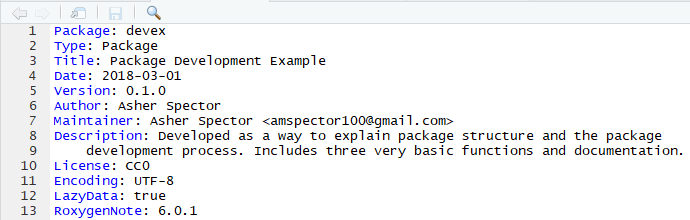
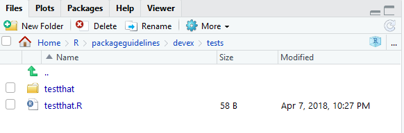
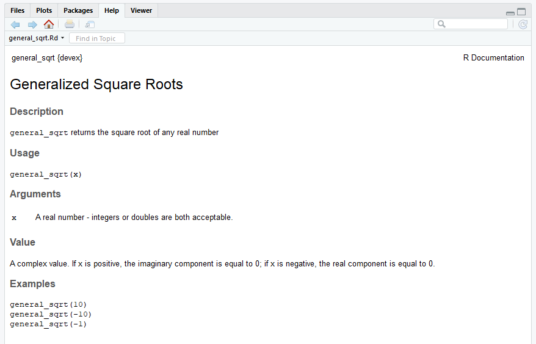

# Package Development

The following graphic outlines this entire chapter:


As a quick reminder, you can find the `devex` example package linked [here, on GitHub](https://github.com/amspector100/packageguidelines/tree/master/devex), if you'd like to look through it while reading the guide.

## Downloading Development Tools

Before we get started, you'll want to download four packages that are extremely useful for package development. For Mac/Linux users, head to the R Gui (or your favorite IDE) and run the code below to download the packages. If you are prompted to choose a CRAN mirror for your session, simply pick the mirror closest to your location.

```{r, eval=FALSE}
install.packages('devtools')
install.packages('usethis')
install.packages('roxygen2')
install.packages('testthat')
```

If you are using Windows, prior to running the above code, you will need to install "RTools" by following these instructions:

1. Go to https://cran.rstudio.com/ and select "Download R for Windows."

2. Click "RTools" and download the latest version of the tools (or the tools that are compatible with your version of R).

3. Let the installer run itself (the defaults are fine).


## Initializing the Package

Now we can begin to walk through the process of creating an R package. The first thing you'll always want to do is run the following function to initialize the package:

```{r, eval = FALSE}
usethis::create('path/to/desired/location/packagename')
```

Note that the path specified by `usethis::create` must currently be empty, otherwise `usethis` will throw an error. Successfully running this function will create a couple of important files which constitute a skeletal outline of the package. In particular, it will create:

1. An 'R' subdirectory in the root of your specified directory, which is where all of core the R code of your package will live.
2. A DESCRIPTION file, which will come with a couple of preset fields.
3. A NAMESPACE file.

You can then set the working directory for your project to an "active" status:

```{r, eval = FALSE}
usethis::proj_set('path/to/desired/location/packagename')
```

Once you've set up the basic structure of your package, you can start modifying files and writing it in earnest!

## The DESCRIPTION

The DESCRIPTION file gives an extremely brief overview to the package. It includes critical information such as the author of the package, the title, a very short summary of its purpose, and the licensing information. Open the "DESCRIPTION" file using your favorite text editor in order to inspect and edit its contents.

DESCRIPTION is a DCF file. This file format may be unfamiliar, but it's quite simple. Each line contains a field name and value, separated by a colon. Sometimes, values are long enough to require multiple lines, in which case they are indented by four spaces. For example, the DESCRIPTION file for the `devex` package might look something like this:



Let's go through the fields and discuss what they mean. The first seven fields listed are mandatory, meaning that if you do not include them, the development environment will throw an error later on when you're trying to build your package.

1. **Package**: This is the name of the package. It should match the package name you chose earlier, and you should probably just leave this as is.
2. **Title**: A short but more descriptive title of your package than its name.
3. **Version**: The version of your package. Since you're creating this package for the first time, presumably it's version 0.1.0.
4. **Author**: Here, you should add in your name.
5. **Maintainer**: Here, you should add in your name as well as a valid email enclosed in <> brackets. Note that if you do not enter a valid email, the development environment may throw errors later.
6. **Description**: This should be a one-paragraph *comprehensive* description of the package. It is necessarily a high level-description, but it should be a complete one.
7. **License**: You should add in a License, which describes how others can legally use the package. Most of the time (especially in the US), you should write 'CC0' in the License field, which implies that the package is open for all use, and you have relinquished all your rights to it. For more information on various licensing options, click [this link](https://cran.r-project.org/doc/manuals/r-release/R-exts.html#The-DESCRIPTION-file).

(Note all of the fields from this point on are optional, but encouraged!)

8. **Type**: This describes what type of project you're creating - in this case, because you're creating a package, you should write "Package."
9. **Date**: The date, in YYYY-MM-DD fashion.
10. **LazyData**: Write "true" after LazyData and the colon. Writing 'true' ensures that if you include any data with your package (which you frequently will), when another user loads your package, they won't automatically load up the data, but will only load it if it becomes necessary during their use. This option reduces the amount of RAM users have to expend when loading packages, especially if you are planning to include a lot of data with your package.
11. **Encoding**: Just leave this as "UTF-8"; discussing what encodings are isn't super important for this guide. If you're dying to learn about encodings, visit [this webpage](https://www.w3.org/International/questions/qa-what-is-encoding).
12. **RoxygenNote**: Roxygen will automatically fill in the version of `Roxygen2` used to build the package in this field.

(These fields are exceptionally important if you are building a package using tools from other packages)

13. **Imports**: In this field, you should list the packages which your package needs to function. Each package should be indented by two spaces, separated by a comma, and given its own line. For example, a pacakge which requires `ggplot2`, `nlme`, and `rpart` might have an 'imports' field which looks like this:


14. **Suggests**: Sometimes, your package will not really *require* the use of other packages, but it might offer a couple of extra wrappers/functions with those other packages. When those extra functions aren't strictly necessary, it's a good idea to have your package *suggest* imports. For example, a package which includes the following function should include `ggplot2` in the 'suggests' part of the description.

```{r, eval=FALSE}


scalep <- function(d, x=1){
  ...
  # If ggplot2 is available, use its qplot function - else, use the default hist function
  if (requireNamespace("ggplot2", quietly = TRUE)) {
    ggplot2::qplot(r, geom='histogram')
  } else {
    hist(r)
  }
  ...
}
```

Here, the function `requireNameSpace()` checks if `ggplot2` is available, and if not, the function uses the (slightly less pretty) default histogram function.

Once you know which packages to list in the 'suggests' section, you can list them exactly the same way you'd list functions in the 'imports' section: each package is indented by two spaces, separated by a comma, and gets its own line.

In general, it's best to suggest functions instead of requiring them if you barely use them in your package. This will give users a bit more flexibility, because it won't force them to download packages they will probably never use.

## Writing Code

### General Coding Guidelines

All of your code should be in scripts in the 'R' file created in the package development environment, as shown below:


The coding you will do in package development is slightly different than the coding you'll normally do when writing R scripts. This is for a couple of reasons:

1. When you write a script and load that script using `source(script_name)`, the code in the script runs when you load it (specifically, when you run the `source()` command). On the other hand, the code in a package is run when the package is *built* on your computer. As a result, your code should mostly be focused on building functions, as opposed to a series of actions which the computer ought to take.
2. Unlike your personal scripts, other people will be using your package, and if your package is good, they'll be using it in ways you didn't anticipate. This means you ought to really try to make sure your code is as general as possible and can support a variety of approaches and implementations.
3. Also, because other people will be using your package, you should avoid modifying the global environment with your package. This means avoiding using functions like `require()`, `library()`, or `source()`; instead, there are other alternatives which can accomplish the same goal without changing the global environment and potentially giving other users an unwanted surprise. For example, instead of using `library()` and `require()`, you should be listing your necessary imports in the DESCRIPTION file, as outlined above, and then R will make sure anyone who installs and loads your package also has any other packages your package depends on. The one catch is that you'll now have to append `packagename::` in front of the imported functions you want to use, otherwise R won't recognize them. For example, to use the `qplot()` function from the `ggplot2` package, the code should look like:

```{r, eval=FALSE}
 ...
scalep <- function(d, x=1){
 ...
  ggplot2::qplot(r, geom='histogram')
 ...
}

```

The last thing you should know is that if you want your package to plot things, you will have to surround the `plot` commands with a `print` statement, like this:

```{r, eval=FALSE}
 ...
scalep <- function(d, x=1){
 ...
  print(ggplot2::qplot(r, geom='histogram'))
 ...
}

```


You should also take care to organize your functions properly. It's probably a bad idea to stick them all into one script and title it "functions." Instead, you should organize functions by their purposes - for example, a variety of loss functions might go into a single script. Of course, some very complicated functions might deserve their own script. The file names of the script should be descriptive - for example, a script of loss functions might be named "loss_functions.R".

### Code Style

Now let's talk about code style. These recommendations are shortened and adapted from [Hadley Wickham's book](http://r-pkgs.had.co.nz/r.html), which in turn were adapted from Google's style guide.

1. **Comments**: Comments are the best way to make your code readable. In general, you should err on the side of commenting too much rather than too little, and your comments should explain the *motivation* of your code as opposed to what your code actually does (although admittedly the line between those two things is a bit blurry). Moreover, you can use lines of '# ---------------------------' or '# ==================' to separate sections of your code. Here are some examples:

```{r}

# Returns the squared element-wise difference between two vectors
loss <- function(x,y) {
  error <- (x-y)**2
  return(error)
}
#---------------------------------------------------------------------------

# Takes the square root of any real number, returning a complex number
general_sqrt <- function (x) {
  # Return the normal square root if x > 0
  if (x > 0 || x == 0) {
    return(complex(real=sqrt(x), imaginary=0))
  }
  # Else return the complex square root
  else {
    return(complex(real = 0, imaginary = sqrt(-x)))
  }
}
```

2. **Names**: Variable and function names should be descriptive but concise, and variable names should generally be nouns whereas function names tend to be verbs. Most R developers keep their function/variable names all lowercase and separate multiple words with underscores. There are no strict rules on this, but it's nice to be consistent with *some* rules because it makes your code readable.

```{r, eval = FALSE}
# Bad example - function name
f <- function(x) {
  return(sqrt(x))
}

# Good example - function name
take_sqrt <- function(x){
  return(sqrt(x))
}

# Bad example - variable name
s <- read.table(path)

# Good example - variable name
car_data <- read.table(path)

```

3. **Curly Braces**: You should start a new line after you write an opening curly brace, and ending curly braces should get their own lines, unless you have an else clause or the line is exceptionally simple.

```{r, eval = FALSE}
# Bad examples

if (condition) {
  complicated_function(x)} # Ending curly brace should get a new line

# Good examples
if (condition) {do(x)} else {do(y)}

if (condition) {
  complicated_function_call(arg1, arg2, arg3)
} else {
  other_complex_function_call(arg7, arg3, arg5)
}

```

As always, you can break the rules if you have a good reason to.

Different organizations and programmers may have different styles, but in general, you should remember:

1. Your goal should always be to make your code readable!
2. Whatever style guide you follow, follow it *consistently*
3. When in doubt, follow the conventions of the organization you're working for

### Warnings and Simplicity

Consider the case of the `scalep()` function, which currently takes a 2-column dataframe as an input, divides the second column by the first, and returns/graphs some scaled proportion of the quotient vector. One version of this function, which follows almost all of the guidelines above, might look like this:

```{r, eval = FALSE}
scalep <- function(d, x=1){

  # Intialize resulting vector
  result <- c()

  # Iterate through and divide column 2 of d by column 1 of d
  i <- 0
  while(i < length(d[ ,1]) + 1){
    row <- d[i,]
    result <- append(result, row[[2]]/row[[1]])
    i <- i + 1
  }

  # Print the graph using either ggplot2 or the hist function
  if (requireNamespace("ggplot2", quietly = TRUE)) {
    print(ggplot2::qplot(result, geom='histogram'))
  } else {
    print(hist(result))
  }

  # Return the result, multiplying by the optional scalar
  result <- x*result
  return(result)
}
```

However, this function still has a couple of problems. It's not super easy to use because (a) it's understandably hard for other programmers to remember which column is divided by which and (b) there's a simpler way to accomplish the code above which will make it more readable. Specifically, it might be easier to just have arguments called 'factors' and 'divisors' and then divide them, like this

```{r, eval=FALSE}
scalep <- function(factors, divisors, constant = 1) {

  # Divide and multiply by optional scalar
  proportions <- constant*factors/divisors

  # Print the graph using either ggplot2 or the hist function
  if (requireNamespace("ggplot2", quietly = TRUE)) {
    print(ggplot2::qplot(proportions, geom='histogram'))
  } else {
    print(hist(proportions))
  }

  # Return the result
  return(proportions)
}

```

The new argument structure will make it a bit easier to use. Similarly, the new structure simplifies the code, making it a bit more readable. However, it does pose one problem: whereas the previous structure mandated that the two vectors be the same length (because they were part of a dataframe), in this function, the two vectors might not be the same length and the function would not always throw an error (specifically, if 'factors' has a length which is is an integer multiple of the length of 'divisors', R will not warn the user at all). This problem is a type of **silent error** (silent errors are bugs which do not issue warnings or errors). Silent errors are terrible because they make bug-hunting extremely difficult: in large repositories of code, it becomes nearly impossible to find which specific line is causing problems without some kind of warning. Thus, it's also worth adding in a couple of lines to warn the user if the factors and divisors are of different lengths, as is outlined below:

```{r, eval=FALSE}

  # Check divisors and factors are the same length
  if (length(divisors) != length(factors)) {
    warning('Length of divisors argument is not equal to length of factors argument')
  }

```

Lastly, it's just worth adding an extra optional argument to let your users turn off the graphing feature of `scalep()`, just to make the function more useable, as follows:

```{r, eval = FALSE}

scalep <- function(factors, divisors, constant = 1, graph = FALSE) {

  ...

  # If graph = True, print the graph using either ggplot2 or the hist function
  if (requireNamespace("ggplot2", quietly = TRUE) & graph) {
    print(ggplot2::qplot(proportions, geom='histogram'))
  } else if (graph) {
    print(hist(proportions))
  }

  ...

```


To summarize, this subsection thus contained three core ideas: (1) make your code simple, (2) make it easy to use by labeling arguments, and (3) always avoid silent errors.

### Loading Your Code

If you've finished writing your code and want to play with it a little bit, you can use the following function:

```{r, eval = FALSE}
devtools::load_all()
```

which (according to its documentation) "roughly simulates what happens when a package is installed and loaded with library." As we'll see in the [build](#releasing-your-package), [testing](#testing), and [RStudio](./integrated-development-environments.html#ex-building-packages) sections, there are better ways to simulate the user experience and test your code, but load_all is often a useful intermediate step.

## Testing

### Why should you test?

Suppose an imaginary programmer named Grace has created a package and has been using it for a while, but she decides she'd like to modify one function to improve it. She modifies her function, tests it a bit, and then publishes a new version of the package. Yet two weeks later, another imaginary programmer named Carlos discovers that the changes she made created a bug in *another* function in the package! This situation is very annoying, especially if Carlos has no idea what has caused the bug or how to fix it. Unfortunately, it's also an extremely common problem.

The solution to problems like this is to test your package *systematically* and *automatically*. If Grace had rigorously tested the entire package before publishing it, Carlos would never have had to deal with the new bug- Grace would have found out immediately. In other words, a good principle in package development is to make sure your code *fails as fast as possible,* so you can find out and fix it. Of course, all programmers test their code, but not everyone tests systematically and automatically.


### What are unit tests?

Tests compare the *expected* output of a block of code to its *actual* output. For example, the following test tests whether the "generalized square root" function actually returns $2$ as the square root of $4$.   

```{r, eval=FALSE}
expect_equal(general_sqrt(4), complex(real = 2, imaginary = 0))
```

*Unit tests* usually run on the computer of the developer who is modifying a package and also should run automatically upon building a package.

We'll talk a little more about how exactly to create tests below, but hopefully this makes the general concept clear (you've also probably been using the general concept as you program).

### Setting up the testing environment

Creating unit tests is actually quite easy, thanks to a package called `testthat` which works in combination with `usethis`. To begin, you should run the following command in your favorite IDE, or even in the R Gui:

```{r, eval=FALSE}
usethis::use_testthat()
```

This will do a couple of things. First, it will add `testthat` to the Suggests part of the DESCRIPTION, which will help other collaborators know to use `testthat` when modifying/working on the package. It will also create a 'tests/testthat' directory in your project, as well a file called 'test/testthat.R', as shown below.



### Expectations

Before discussing how to write unit tests, we need to properly describe an expectation. An expectation tests whether the actual output of a single function call is what the developer expected. The `testthat` package has a number of functions which compare outputs to expected values. When calling one of these functions, one of two things can happen:

1. If the actual output matches the expectation, nothing will happen!
2. If the actual output does not match the expectation, it will throw an error.

For example, `expect_equal()` uses the base R function `all.equal()` to check whether an output is (approximately) equal to an expectation. In the following code, the first function call will do nothing - the second function call will throw an error, displayed below.

```{r, eval = FALSE, error = TRUE}
library(testthat)
testthat::expect_equal(2, 2)
testthat::expect_equal(2, 4)
```


Here's an (abbreviated) list of the expectation functions:

1. **expect_equal**, as aforementioned, checks equality using the "all.equal()" base function.
2. **expect_identical** checks equality using the `identical()` base function. Generally, it's better to use `expect_equal()` because lots of R functions use numerical approximations which will cause expect_identical to fail when you don't want it to.
3. **expect_match**, **expect_output**, **expect_message**, **expect_warning**, and **expect_error** all respectively test whether a string, output, warning, or error match a regular expression. For example, the following two expectations functions will not throw errors:

```{r}
testthat::expect_match('hello1234', 'hello')
testthat::expect_warning(sqrt(-2), 'NaNs produced')
```
The tests do not fail because (i) 'hello1234' contains 'hello' and (ii) the error message produced by `sqrt(-2)` contains the phrase 'NaNs produced'.

4. **expect_is** tests whether an object inherits from a class, specified in quotes. For example, the following test passes:

```{r}
testthat::expect_is(sqrt(2), 'numeric')
```

5. **expect_true** and **expect_false** respectively expect a statement to evaluate to TRUE or FALSE.

### Structure and Location of Unit Tests

Each *unit test* (which is written in an R script) should use a couple of expectations to test a single core function. It should use the function `test_that()` (from the `testthat` package). `test_that()` takes two parameters: a string, which describes the test, and a couple of expectations, surrounded by curly braces. For example, the following code will test whether the `general_sqrt()` function from the `devex` package returns a complex number.

```{r, eval=FALSE}
test_that("Returns complex number", {
  expect_is(general_sqrt(-2), 'complex')
  expect_is(general_sqrt(2), 'complex')
  expect_is(general_sqrt(0), 'complex')
})
```

Multiple tests with similar functions should be put in the same file, and those test files must be put in the tests/testthat/ directory. Moreover, their name must start with the word 'test' - this will help R automatically run your tests for you.  For example, in the `devex` package, there are two very simple helper functions (`general_sqrt()` and `loss()`) and one moderately complex function (`scalep()`). As a result, the `devex` package has exactly two testing files: one called 'testhelpers', which tests the helper functions, and another called 'testscalep', which tests the `scalep()` function. The 'testhelpers' file looks like this:

```{r, eval=FALSE}
library(devex)
context("generalized sqrt and loss")

# Generalized sqrt ---------------------------------------

test_that("Returns complex number", {
  expect_is(general_sqrt(-2), 'complex')
  expect_is(general_sqrt(2), 'complex')
  expect_is(general_sqrt(0), 'complex')
})

test_that("Returns correct sqrt", {
  expect_equal(general_sqrt(-1.53), complex(real = 0, imaginary = sqrt(1.53)))
  expect_equal(general_sqrt(-2), complex(real = 0, imaginary = sqrt(2)))
})

test_that("Warnings for vectors of length > 1", {
  expect_warning(general_sqrt(c(2, 0)))
  expect_warning(general_sqrt(c(-2, 0, 2)), 'NaNs produced')
})

# Loss ---------------------------------------------------

test_that("Returns correct loss", {
  expect_equal(loss(0, 3), 9)
  expect_equal(loss(c(1, 1, 1), c(1, 2, 3)), c(0, 1, 4))
  expect_equal(loss(c(-1, -5, -2), c(0, 0, 0)), c(1, 25, 4))
})

```

Each test file, as demonstrated above, needs to load the package of interest (using `library()` is fine) and also should supply a string which succinctly describes the general purpose of all of the tests in the test file to the `context()` function.

You can run all of the tests in the test/testthat directory by running the following `devtools` function:

```{r, eval = FALSE}
usethis::test()
```

If any test throws an error, R will report two things. First, it will report the string given in the test which was given to the `test_that()` function call. Second, it will report the filename of the test file as well as the line of code that threw an error. For example, running the above tests yields the following result:


This indicates that line 18 of testhelpers.R failed in the test "Warnings for vectors of length > 1." Looking at the test code reveals that the `general_sqrt()` function does not return a warning for positive vectors of length greater than one.

```{r, eval = FALSE}
expect_warning(general_sqrt(c(2, 0)))
```

To fix this, it might be worth adding in an extra line or two which ensures that the input to `general_sqrt()` is as it should be (to prevent users from getting unexpected results).

### Writing Good Tests

Good tests have a couple of characteristics.

**First**, good tests have high *coverage,* meaning that they test a large percentage of the lines of code of the package. For example, the code for the `general_sqrt()` function is as follows:

```{r, eval = FALSE}
# This function takes the complex square root of real numbers

general_sqrt <- function (x){

  # Issue warning for longer vectors
  if (length(x) > 1) {
    warning('Argument of general_sqrt has length greater than 1')
  }

  # Return the normal square root if x > 0
  if (x > 0 || x == 0){
    return(complex(real = sqrt(x), imaginary = 0))
  }

  # Else return the complex square root

  else {
    return(complex(real = 0, imaginary = sqrt(-x)))
  }

}

```

The following test has low coverage for the `general_sqrt()` function:

```{r, eval = FALSE}
test_that("Returns correct sqrt", {
  expect_equal(general_sqrt(-1.53), complex(real = 0, imaginary = sqrt(1.53)))
  expect_equal(general_sqrt(-2), complex(real = 0, imaginary = sqrt(2)))
})

```

because it only tests whether `general_sqrt()` returns the correct square root for negative numbers. This test thus only covers half of the code in `general_sqrt()`, because the mechanism for dealing with nonnegative numbers is entirely separate. The following test is a better example, because it tests both positive and negative numbers.

```{r, eval = FALSE}

test_that("Returns correct sqrt", {
  expect_equal(general_sqrt(1.53), complex(real = sqrt(1.53), imaginary = 0))
  expect_equal(general_sqrt(-2), complex(real = 0, imaginary = sqrt(2)))
})

```

**Second**, it's important to remember that coverage is only important because tests with high coverage tend to test all the different functionalities of a package. It's possible to have tests which have very high coverage but aren't great tests. Consider the following example.

```{r}

print_it <- function(text){
  print('hello')
}

testthat::expect_warning(print_it('hi'), NA)

```

This expectation has 100% coverage because it will run every line of code (the expectation will also pass because no warning will be thrown). However, it's not sufficient alone because it doesn't actually test whether print_it returns the desired output: in this case, print_it will always print 'hello'. In other words, the expectation does not test all of the functionality of the function.

**Third**, tests should run relatively quickly, if possible. Sometimes, it's okay to maximize coverage even if you don't test every single functionality to save time, because *usually* high coverage ensures you test most of the functionality of the package. This is particularly true because lots of integrated testing software (which we'll discuss in integrated tests) will not be able to easily run tests which take too long. More on that later.

**Fourth**, tests should be clear to the reader, because sometimes there are bugs in tests too. If others eventually help develop or maintain your packages, they'll want to know what it means when a test fails. Moreover, for large packages, you yourself may have trouble remembering the exact details of every test you've written. Thus, your tests should return clear error messages and be readable. For example, the following test is a bad example, for two reasons:

```{r, eval = FALSE}

sigmoid <- function(x, a, b){
  return(exp(a*x)/(exp(a*x) + b))
}

test_that('sigmoid output', {
  expect_equal(sigmoid(0.3068528, 1, 1.3591409), 0.5, 10^-7)
})

```

The string 'sigmoid output' does not describe the purpose of the test, which is to test the precision of the sigmoid output. This means that if the test fails, it will be hard to tell what's wrong. Additionally, the purpose of the test is not clear to begin with - what do the seemingly random decimals mean? At the very least, it's probably worth putting comments in explaining the point of the test, as shown below.

```{r, eval = FALSE}

sigmoid <- function(x, a, b){
  return(exp(a*x)/(exp(a*x) + b))
}

test_that('test sigmoid precision', {

  # Check sigmoid(ln(e/2), ln(e/2), e/2) is very close to 1/2.

  expect_equal(sigmoid(0.3068528, 1, 1.3591409), 0.5, 10^-7)
})

```

This test is a bit more interpretable and delivers a better error message.

### Automated Checking

The `usethis::test()` function is pretty nice, but all it does is run your unit tests - it doesn't check everything else in your package. Thankfully, the `devtools::check()` function fills this gap.

```{r, eval = FALSE}
devtools::check()
```

Running the check function will ensure your documentation is up to date, automatically run all of your unit tests, and even check your code for common problems. It will also create a new directory called 'Man' within your package folder, which will later be populated with the help files for your functions. Note that even if your package passes all of its tests, you might still see additional warnings for other reasons, as exemplified below:


Although it's not necessary to understand every check that the check function runs, it's worth noting that every check it performs is relatively important, and if it signals any warnings or errors, it's definitely worth fixing them. It's also probably worth fixing any "notes" it issues. If you're curious, you can read more about what each type of check in the automated check does [here](http://r-pkgs.had.co.nz/check.html#check).

### Bonus: The goodpractice Package

The aforementioned automated checking system for R is pretty good, but there is a slightly more comprehensive version: the [goodpractice package](https://github.com/MangoTheCat/goodpractice/blob/master/vignettes/goodpractice.Rmd). The `goodpractice` package has an informative name - the entire purpose of the package is to check whether your package follows proper package development conventions and procedures (i.e. whether your package follows good practices). For example, running the `goodpractice` package on the `devex` package yielded the following helpful results:


Let's run through the key points of using `goodpractice` below.

To install the goodpractice package, just run the following command in the R console:
```{r, eval=FALSE}
install.packages('goodpractice')
```

Once you've installed the `goodpractice` package, you basically only need to use a single function from it: the `gp()` or `goodpractice()` function (which call the same code). This function will run comprehensive automated checks on your package, and it takes exactly one input, the path of your built package. However, it's important to note that the path of your *built* package is not identical to the path of the repo containing it. For example, I work on the `devex` package in "C:/Users/amspe/Documents/R/packageguidelines/devex", but the built package lives at "C:/Users/amspe/Documents/R/win-library/3.5/devex". For `goodpractice` to work, you need to use the paths of the *second* form, i.e. where the built package lives. If you don't know this path immediately, you can use the "system.file" function to retrieve it for you, as demonstrated below.

```{r, eval = FALSE}
# Retrieve path
package_path <- system.file(package = 'devex')

# Check package
library(goodpractice)
gp(package_path)
```

And that's it! The `goodpractice` package is a bit picky, so it's okay to leave a few concerns unresolved, but in general it gives good advice. If you're diligent, you might eventually see a result like this:


which signals that your package conforms to all good practices. Lastly, although it's beyond the scope of this guide, you ought to know that you can create custom checks using the `goodpractice` package, as documented [here](https://github.com/MangoTheCat/goodpractice/blob/master/vignettes/custom_checks.Rmd).

### Tips and Tricks

When testing, there are a couple of key principles to keep in mind:

1. You want to expose bugs as quickly as possible so they don't create even larger headaches down the road! As Christopher Gandrud puts it, testing is all about 'failing faster.' To this end, you should continuously test your packages.
2. Make sure your tests *cover* the package code and also test all of the key functionality of the package. In an ideal world, a package should pass all of its tests only if all of its core functionality is bug-free.
3. Test names, organization, and error messages must be descriptive and easy to understand. One of the main purposes of tests is to inform you *where* your code is failing, and to understand that, you need informative error messages. Otherwise, you will find yourself spending hours traversing your code to find bugs.  

The `devtools` cheatsheet, linked [here](https://www.rstudio.com/wp-content/uploads/2015/03/devtools-cheatsheet.pdf), references a lot of the key components of the `testthat` package.

Lastly, working with .yml files can occasionally be difficult, although `devtools` should make it pretty to set up in the broad majority of cases. As always, when you run into errors, make full use of [stackoverflow](https://stackoverflow.com/questions/tagged/r) and online resources provided by AppVeyor/Travis.

## Documentation

Documentation is an absolutely essential part of any package - most people won't be willing to read your source code to figure out how your functions work. Thankfully, creating documentation for your package is incredibly easy with `Roxygen2`.

### Documenting Functions

(Note: here, we describe how to document functions. For a more detailed description of how to document S3, S4, and reference classes, check out [this page](http://r-pkgs.had.co.nz/man.html).)

To understand how to use `Roxygen2`, it's best to start with an example. Consider the following code, which generates the documentation for the `general_sqrt()` function above.

```{r, eval=FALSE}

#' Generalized Square Roots
#'
#' \code{general_sqrt} returns the square root of any real number
#'
#' @param x A real number - integers or doubles are both acceptable.
#' @return A complex value. If x is positive, the imaginary component is equal to 0;
#' if x is negative, the real component is equal to 0.
#'
#' @examples
#' general_sqrt(10)
#' general_sqrt(-10)
#' general_sqrt(-1)
#'
#' @export
# This function takes the complex square root of real numbers

general_sqrt <- function (x) {

  # Return the normal square root if x > 0
  if (x > 0 || x == 0) {
    return(complex(real=sqrt(x), imaginary=0))
  }

  # Else return the complex square root

  else {
    return(complex(real = 0, imaginary = sqrt(-x)))
  }

}
```



Inside the R script, the documentation appears right above the definition of the function - this is helpful because it will help you remember to keep your documentations/functions up to date with each other. Let's work through how this documentation was generated.

1. Note that everything you write in `Roxygen2` should be preceded by a #' character combo. This signals to the R environment that you're writing documentation, not code.

2. You should start your documentation with a very short (2-4 word) title of the function. In the example given above, the `general_sqrt()` function is titled "Generalized Square Roots."

3. You should describe your functions' parameters using the '@param' signifier. This should succinctly describe the type (i.e. double, integer, character) of the parameter, as well as its function, as well as any potential default value.

4. You should document the type of output your function returns. Is it an integer, a dataframe, a matrix? Does it depend on the input? Your documentation should answer these questions!

5. You *must* provide examples of your function's use. These are pretty critical, because a lot of programmers will just skip straight to the examples (and only look at the rest of the documentation if the examples are unclear).

6. You may choose to write '@export' at the end of your documentation block. You should only do this if you want other people to use the function that you're exporting, because exporting it will make sure it shows up in the **namespace**, a document that makes sure your package works in combination with other packages. For example, if your package includes data labelled 'lm', the namespace will prevent errors when using that data in combination with the R stats package (which has a function called 'lm') and will *not* throw an error. The [exact mechanics of the namespace](http://r-pkgs.had.co.nz/namespace.html) are slightly beyond the scope of this guide, but thankfully `Roxygen2` will automatically generate a namespace for you when you create documentation with "@export" tags.

Note that most functions you write won't be exported - for example, if you write a helper function like `loss()` which is only used in service of a larger function, it shouldn't be exported (exporting too many functions 'clutters' the namespace).

Once you've written all your documentation, it's fairly simple to check what it looks like. Simply run the following function:

```{r, eval = FALSE}
devtools::document()
```


which will automatically generate your documentation. Then, if you've documented a function, you can type `?function-name` into the console, and the documentation should automatically pop up!

After documenting your package, you can also click the '/man' folder to inspect the documentation html files `Roxygen2` generates, but it probably won't be more informative than simply typing `?function-name` into the console.

### Adding a README

The README file is a bit different than the others, because your package will actually work fine even if you don't have one. However, if you want other people to use your package, it's best to have a README. The purpose of a README is basically to bridge the gap between the DESCRIPTION and the actual documentation in your package. In other words, someone using your package might know what it does in a general sense from your DESCRIPTION, but they won't necessarily know exactly how to set up the package or how to use specific functions. The README takes care of that. In general, READMEs should do at least two things, with a couple of optional ones:

(Important):

1. Offer a longer (one to three paragraph) description of the package, including core functions and bits and pieces of syntax
2. Help users install and set up the package

(Optional from here on):

3. Tell developers what to do if they want to contribute to your package
4. Help contributors figure out how to run the packages' unit tests (we'll talk more about unit tests in the next section)
5. Offer some acknowledgements

This template linked [here](https://gist.github.com/PurpleBooth/109311bb0361f32d87a2) is pretty good. Again, because your package will technically function without your README, the actual structure and content of a README can be flexible. However, just remember that if you don't have a README which outlines why and how to use your package, other developers are unlikely to want to use it.

## Vignettes

Documentation is useful, but not necessarily a comprehensive guide to your package. You may want to include details about your implementation, extra examples, and more organization than your documentation provides, which is exactly what vignettes are for.

**Vignettes** are basically articles which motivate and describe your packages. They are generally written in RMarkdown, which allows you to mix code, mathematical equations, and formatted text with ease. If you are using RStudio, then writing vignettes will be very easy, because RMarkdown works automatically with RStudio. On the other hand, if you don't have RStudio, you will need to (i) run the 'install.packages("rmarkdown")' command, and (ii)  install [pandoc](http://pandoc.org/installing.html).

To write a vignette, start by running the `use_vignette()` function from the `usethis` package:

```{r, eval = FALSE}
usethis::use_vignette('vignette-name')
```

This function will create a 'vignettes' subdirectory and populate it with a file based on the name you specified. The file should look something like this:


The top of the file, between the two lines of dashes, is written in the YAML language. It's simply a convenient way to specify metadata about a vignette, and you should fill in the title and author fields.

The rest of the vignette should be written in RMarkdown, which is basically a mix of Markdown, Latex, or code. The vignette template generated by `usethis` *is itself a guide to using RMarkdown*, so we won't dive too deep into using RMarkdown. However, there are a couple of core things you should know:

1. By default, text in RMarkdown files is assumed to be written in [pandoc's flavor of Markdown](http://pandoc.org/MANUAL.html).
2. If you would like to include inline equations, you can do so by surrounding math symbols with a single dollar sign on each end. If you'd like to give an equation its own line, you can use two dollar signs on each end of the equations.


3. You can add chunks of R code (and even other languages!) to your Vignette file by wrapping R code in "```" symbols, as demonstrated below:


Once you've modified your vignette, you can *knit* it into a beautiful HTML document by running the following function in the console:

```{r, eval = FALSE}
rmarkdown::render('path/to/rmarkdown/file.Rmd')
```

If you do choose to write vignettes, remember that it's critical to motivate *why* you wrote your package in the first place. Additionally, you should structure the vignette so that it gives users an impression of the overarching structure of the package itself (i.e. group and organize your functions!).

## Adding and Documenting Data

Sometimes, you'll want to include data as part of your package, either to serve as an example for users or because your functions need it to work. This is totally optional - not all packages need to include data - but can be useful, so let's walk through how to include (and document) data in your package. Note that there are at least two kinds of data you should think about including, but for both kinds of data, you should generally save them as '.rdata' or '.rda' files (which are the same thing).

### Including data which should be available to users

All of the data you want to be available to users should be saved in a folder called 'data' inside your project. The way to do this is to write and run a script which loads your data into R and then uses the `usethis` function `use_data()` to save it to a path inside 'data.' Even if you do not already have a folder called 'data' in your package, the `use_data()` function will make it for you. Note that for this to work, your working directory must be set to the package you're writing, otherwise `usethis` won't know where to put your data.

For example, when documenting the `scalep()` function, one might want to include data as an example of a way to use `scalep()`. To this end, I've generated a (totally fake) .csv file which lists 100 people's income and luxury spending, and has saved it to the   

```{r, eval=FALSE}
luxspending <- read.csv('C:/Users/name/Documents/R/datapath.csv', header=TRUE, sep=',')
usethis::use_data(luxspending)
```

Data in your 'data' folder will effectively always be exported, so you always must document it. To document data, you should create an R Script in your 'R' directory called ['data.R'] and use `Roxygen2` to document the data similarly to the way you'd document a function. For example, one might document the aforementioned data in the following way:

```{r, eval=FALSE}
#' Luxury spending of 100 individuals
#'
#' This dataset lists the net incomes and the luxury spending
#' of 100 individuals.
#'
#' @format A dataframe with 100 rows and 2 columns.
#' \describe{
#'   \item{Income}{Total Income, in USD}
#'   \item{Luxury_goods}{Spending on luxury goods, in USD}
#'}
#' @source This dataset was randomly generated
#' and is intended only to be used as an example for package
#' development and the scalep function.
"luxspending"
```

This should all look pretty similar to documenting functions. Note that '@format' is a tag which will allow you to describe the structure of a dataset, and it's good practice to list what each column measures in this section. The '@source' section describes where the data came from. Never write '@export' in this section, as data here is already automatically exported.

### Including data for your functions

Some functions may rely on a large, predefined set of coefficients or other inputs which need to be included in the package. However, users shouldn't generally have access to such data because otherwise they might accidentally radically change the way your function works. It's best to put such data in 'R/sysdata.rda', because then users won't easily be able to access and accidentally modify it. As before, the way to include data in this way is to write a script which loads the data into R and then use the `use_data()` function to save it, but you should also include a parameter `internal = TRUE` in the function call to let R know that this is interior, not exterior, data. For example, if a function depends on a matrix called "coefficients", one might run the following code:

```{r, eval=FALSE}
coefficients <- read.csv('C:/Users/name/Documents/R/coefs.csv')
usethis::use_data(coefficients, internal = TRUE)
```

Data in 'R/sysdata.rda' is never exported, so there's no need to document it.

## Releasing Your Package

You're almost done at this point! You've written your functions, modified the description, documented your functions, presumably exported some of them, and hopefully tested all of them; you're now ready to *release* and *publicize* your package. There are basically two main ways to do this.

### Pushing to GitHub

The easiest way to publish your package is to simply [push it to GitHub](.\version-control), (we'll discuss how to do this later). The pros of this approach are that it makes it very easy for users to download your package - they can literally do it in one line. Additionally, Github offers free services [to host a website for your package and its documentation](https://pages.github.com/), and most importantly, it's very easy for **you** to publish your package this way. Thus, pushing to Github is sort of the "default" way to publish a smaller package.  

### CRAN

On the other hand, if you've written a larger package which you would like to distribute to the entire R community, you might consider submitting it to [CRAN](https://cran.r-project.org/), the Comprehensive R Archive Network. CRAN is basically the official package authority designated by the R community, and successfully adding your package to CRAN will make it more legitimate as well as easier for R users to find and install.

Logistically, submitting your package to CRAN is pretty simple. The first step is to **build** your package, which means bundling it into a format that is easy to distribute and easy for users to install.

The best way to build your package is to zip it as a .tar.gz file. `devtools` will do this for you if you run the following command:

```{r, eval = FALSE}
devtools::build(binary = FALSE)
```

and then you should see a tar.gz file pop up just outside your working diretory.

The next step is to submit the bundled file to CRAN [at the link here](https://cran.r-project.org/submit.html), along with a couple of comments. Although this seems pretty simple, in actuality, CRAN has very high standards for packages, so it can be rather tricky to get a package accepted. CRAN's specific standards are   beyond the scope of the current iteration of this guide, but if you decide you want to publish a package on CRAN, you should read [Hadley Wickham's advice on the subject](http://r-pkgs.had.co.nz/release.html) **very carefully.**

#### Optional: Building precompiled binaries

tar.gz files are useful because anyone who has a working R development environment can install and unzip your package, regardless of their operating system. However, you do need a development environment to install packages built as tar.gz files, and some users (in particular on Windows) may not have development environments set up yet. To address this potential issue, another way to build your package is as a **precompiled binary file**. Precompiled binaries are useful because unlike tar.gz files, they do not require a development environment to install. However, they are platform specific: a precompiled binary built by a Windows machine can't be installed on Mac machine. Although tar.gz files are much more common, if you do want to build a binary, you can just change an argument of `devtools::build()`:

```{r, eval = FALSE}
devtools::build(binary = TRUE)
```

and your precompiled binary will be built.

### Publicizing

Once you've released your package either on Github or perhaps on CRAN, you should publicize it! You can of course publicize it any way you choose, but there are at least two things you should consider doing.

1. Tweet about your package using the #rstats hashtag, which reaches a substantial portion of the R community.
2. You may also want to send an email out to the [R-Packages email list](https://stat.ethz.ch/mailman/listinfo/r-packages).

And that's it!

## Tips and Tricks

First, there's a wonderful cheat sheet for package development linked [here](https://www.rstudio.com/wp-content/uploads/2015/06/devtools-cheatsheet.pdf).

Second, if you're having trouble, you can always just reference [stackoverflow](https://stackoverflow.com/questions/tagged/r).
