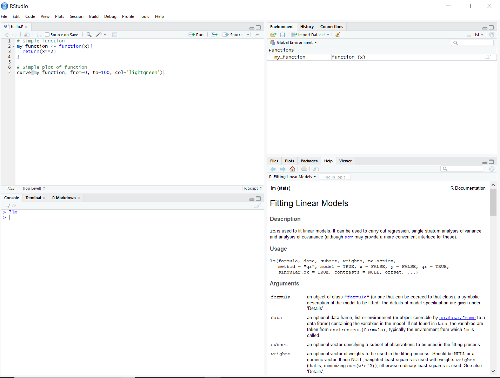

# Development with RStudio

The previous page in the guide was the [Introduction](./index.html). The next page in the guide discusses [GitHub](./githubguide.html). This page will help you set up and install RStudio (we assume you are already somewhat familiar with R). If you already have RStudio installed and are comfortable using it, feel free to skip this section. Lastly, if you really don't want to use RStudio, we'll offer some alternatives in the first main section.

## Why use RStudio?

RStudio has two main advantages, which is why we recommend it for package development.

First, RStudio is generally built to make users' lives easier. It integrates documentation, makes graphics more accessible, and generally makes it easier to write scripts.

Second, RStudio has a suite of tools which make it easy to build well-documented, structured packages. Since this guide discusses package development, RStudio is the natural development environment. 

### What if you don't want to use RStudio?

(If you're planning to use RStudio, you can skip this section).

Some users might not want to use RStudio. That's not the end of the world - you can develop packages without RStudio, it's just a bit more difficult. We highly recommend RStudio because it plays very nicely with the devtools and testthat packages (and a lot of this guide will be devoted to showing users around devtools/testthat). As a result, if you'd prefer not to use RStudio, you can probably just use the devtools/testthat functions directly by looking at their documentation and source code, as linked below. However, it also might be worth trying RStudio, at least for the duration of this guide. 

Here are the links to the current (as of 5.4.18) versions of the [devtools documentation](https://www.rdocumentation.org/packages/devtools/versions/1.13.3) and [source code](https://www.rdocumentation.org/packages/devtools/versions/1.13.3/source), and the [testthat documentation](https://www.rdocumentation.org/packages/testthat/versions/2.0.0) and [source code](https://www.rdocumentation.org/packages/testthat/versions/2.0.0/source). If you don't use RStudio, you'll probably want to look through these as you work through the guide. 

## Setting up RStudio

### Setting up R

Presumably you've already been working with R, but you should make sure you have a recent enough version of R intalled. To do so, type "R.Version()" into the editor you've been working with previously. It should return an output titled "$version.string$", for example:
```{r}
R.Version()
```

If the number after the R version string is anything lower than 3.0.1, you'll have to install a new version of R in order to use R Studio. To do so, follow the steps below:

1. Go to https://cran.rstudio.com/ and select "Download R for [Your Operating System]." 

2. Click "base" and click "Download R [latest version] for [Your Operating System]" at the top of the page.

3. You can then let the installer run itself - the default settings should be fine for our purposes. 

Lastly, updating R on Windows can be a bit tricky. If you use Windows, you can also use the installr package to quickly update R, as documented [here](https://www.r-statistics.com/2015/06/a-step-by-step-screenshots-tutorial-for-upgrading-r-on-windows/). However, if you are having trouble installing the installr package, you can always just follow the instructions above. 

### Downloading Development Tools

You'll also want to download some packages and tools that are important for package development. If you are running Windows, you can do so by following the instructions below:

1. Go to https://cran.rstudio.com/ and select "Download R for Windows."

2. Click "RTools" and download the latest version of the tools (or the tools that are compatible with your version of R).

3. Let the installer run itself (the defaults are fine).

For Mac/Linux users, head to RStudio and run the following code to download the two primary development packages you'll need:

```{r, eval=FALSE}
install.packages('devtools')
install.packages('roxygen2')
```

### Setting up RStudio

To download and set up RStudio, follow the instructions below:

1. Head to https://www.rstudio.com/products/rstudio/download/ and click "download" for the free RStudio Desktop version

2. Download the *installer* for your operating system, not the *zip/tarball.* The picture below illustrates what the webpage should look like. 


3. Let the installer run - it's fine again to just use the default options. 

and now you're ready!

## Basic RStudio Use

### Screen Breakdown

RStudio will split your screen into four parts, as shown below. We'll refer to them as the *script*, the *environment*, the *shell* or *console*, and the *Viewer.*


The *script* is in the upper left hand corner of the screen, and it's where you will do the bulk of your programming. To write an R script, click File>New File>R Script in the top left hand corner. You can execute multiple lines of a script (or the entire thing) at a time by selecting the lines you want to run and clicking the green "Run" button on the right hand side of the script box. 

The *shell* is in the lower left hand corner of the screen. Unlike scripts, which presumably you've worked with before, shells only run one line of code at a time. However, shells also remember what you did before. For example, if you define download some data into the shell, you can manipulate it repeatedly without having to download it again before each manipulation - it will stay in the shell's memory until you manually remove it.

All scripts that you run will be run through the shell - that is, if you run a script, all of the code from the script will appear in the shell. This means that you can run a script and manipulate the results directly from the bottom of the shell, without having to rerun the script each time you want to manipulate the results. You can also directly access the command prompt for your computer through the shell by clicking the "terminal" option.

Note that any errors caused by bugs in your code will show up in the shell. 

On the upper right hand corner of the screen, you can see the *environment* you're working in, which lists all the objects in the shell's "memory" or *namespace.* For example, if you download some data in a script and then run the script, the data will show up in the right hand corner of the screen.

On the bottom right hand side is the *Viewer.* Any plots you generate in R will automatically show up there. Additionally, as we'll discuss later, documentation of functions and packages will appear in the right hand corner. You can also use it to see the file structure of your working directory and the packages you're using by clicking "files" or "packages.""

### Basic Commands

Presumably you're already familiar with R, but you should know a couple of commands specific to RStudio:

1. To remove an object from the environment, use the "rm" function as follows:

```{r, eval=FALSE}
rm(remove_this_object)

```

To remove all objects from the environment, you can use

```{r, eval=FALSE}
rm(list=ls())

```

2. To see the documentation of any specific function, you can type

```{r, eval=FALSE}
?function_of_interest
```

In the example below, you'll find a picture of the documentation for the lm function, which is used for linear modeling. 



3. To get RStudio to stop executing some code, you can press the red "stop" button in the top right of the console section. Sometimes this won't appear, so you can also just hit "escape" keyboard command instead.

4. To clear the console, hit Ctrl+L. 

5. To install packages, you can use the "install.packages('packagename')" command. For example, to install the mosaic package, you could run the following code:

```{r, eval=FALSE}
install.packages('mosaic')
```

A list of useful packages can be found [here](https://support.rstudio.com/hc/en-us/articles/201057987-Quick-list-of-useful-R-packages). 

## Further Reading/Sources Cited

To read more about using R, [take a look at the following website, built by Chapman and Hall](http://adv-r.had.co.nz/)

[This link](https://www.rstudio.com/resources/cheatsheets/) contains a number of truly fantastic cheat sheets, documenting everything from RStudio itself to data visualization and machine learning.

If you're not yet sold on RStudio, [this page](https://www.theanalysisfactor.com/the-advantages-of-rstudio/) lists some more of RStudio's advantages. 
